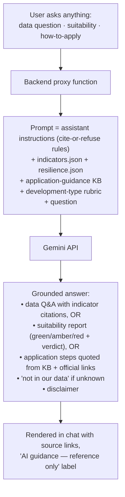
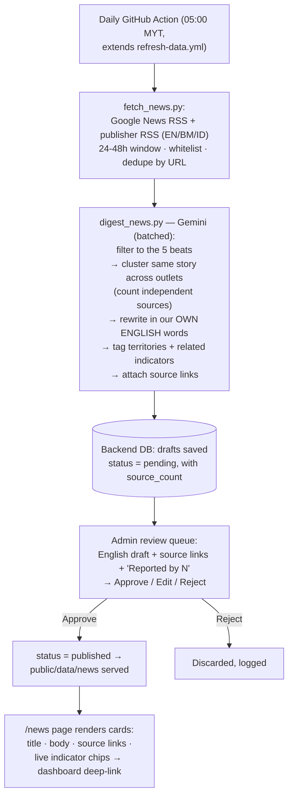

# Borneo Tracker — Additional Requirements Specification

**Project:** T002 Borneo Tracker · **Author:** Henry Chin Jian Hong · **Date:** 2026-07-07
**Status:** Draft for team requirements finalization

This document proposes three additional modules on top of the confirmed core requirements
(map, ESG indicators, SDG progress, RAG status dashboard, open data, admin back-office, mobile app).
Each module is specified with feature description, flow, acceptance criteria, and effort estimate.

| # | Module | Theme | Effort (1 person) | Runtime backend needed? |
|---|--------|-------|-------------------|-------------------------|
| AR-1 | Smart Data Intake (admin back-office) | Data governance | 2–3 weeks¹ | Yes (shared) |
| AR-2 | AI Sustainability Assistant (all-purpose grounded chatbot) | AI interaction / decision support | Phase 1: ~2 weeks (Phase 2 is a stretch goal) | Yes (shared) |
| AR-3 | "Borneo Pulse" AI News Digest (+ weather) | AI content | 2–2.5 weeks | Yes (shared, review/publish) |

¹ Includes the admin back-office foundation (auth, upload, DB write) which is already a **core**
requirement — the truly *additional* portion of AR-1 is ~1 week.

---

## Shared infrastructure (prerequisite for AR-1, AR-2 and AR-3)

- **One small backend service** (FastAPI recommended — the data pipeline is already Python):
  handles admin auth, file upload, and LLM API proxying. Deployable free on Render/Railway/Fly.io,
  or as serverless functions (Cloudflare Workers / Vercel).
- **One LLM API key** (Google Gemini recommended: free tier covers demo traffic; Gemini Flash
  reads PDFs natively including scanned/OCR). The key lives **only** server-side / in GitHub
  Actions secrets — never in frontend code.
- **GitHub Actions secrets** must be configured on `angelyong/Borneo_Tracker`
  (bundle with the pending GFW/BPS/WAQI secrets task).

No model training or fine-tuning is required anywhere in this document. All AI features use
off-the-shelf LLM APIs with prompt-based grounding.

---

## AR-1 · Smart Data Intake — AI-assisted document extraction in the admin back-office

### Problem

18 of 86 published indicator observations (life expectancy, tourist arrivals, electrification,
mean years schooling, UNESCO sites, national parks, Brunei paddy) have **no API source** — they
come from government PDFs, press releases, and web tables. Today they are hand-typed into
`manual_overrides.csv`, which has no validation, no review step, no reminder when data goes stale,
and no way to demonstrate "data management" as a system feature.

### Feature description

The admin back-office gains a **document intake workflow**: an admin finds an official document
(e.g. the Brunei Tourism Industry Performance Report PDF), drags it into the back-office web UI,
and the system — using an LLM — extracts the target indicator value(s), shows them alongside the
**exact source sentence and page number** as evidence, lets the admin correct and confirm, and
writes the accepted observation to the database with full provenance. The public dashboard picks
it up through the existing export pipeline.

The human stays the gatekeeper: AI reads, the admin approves.

### Flow

```mermaid
flowchart TD
    A[Admin finds official document\non government website] --> B[Drag & drop file into\nadmin back-office upload zone]
    B --> C[Backend stores file +\nsends to Gemini with extraction prompt]
    C --> D["LLM returns structured draft:\nterritory · indicator · year · value · unit\n+ exact source quote + page number"]
    D --> E[Confirmation screen:\nPDF page preview (left) vs\nextracted fields (right, editable)]
    E -->|Admin edits if needed,\nclicks Accept| F[(Database: observation saved with\nuploader, timestamp, source file,\nquote, status = verified-manual)]
    E -->|Reject| G[Discarded, logged]
    F --> H[export_json.py regenerates\nindicators.json]
    H --> I[Public dashboard shows value\nwith 'Manual — verified' badge]
```

### Functional requirements

- **FR-1.1** Admin authentication required for all back-office routes (shared with core admin module).
- **FR-1.2** Upload accepts PDF, image, and HTML/URL input, max 20 MB.
- **FR-1.3** Extraction returns, per candidate observation: `territory, indicator, year, value, unit,
  source_quote, page_number`. Observations without a verbatim source quote are rejected automatically.
- **FR-1.4** Confirmation UI renders the source page and pre-fills an editable form; admin can
  amend any field before accepting.
- **FR-1.5** Validation on accept: unit must match the indicator's existing unit; value flagged if
  it deviates >50% from the previous year; year must not be in the future.
- **FR-1.6** Accepted observations are stored with provenance (admin identity, timestamp, stored
  source file, quote) and versioned — previous years are kept, never overwritten (enables trends
  for manual indicators).
- **FR-1.7** Staleness monitor: the daily refresh workflow flags any manual observation older than
  12 months; the dashboard badge changes to "Manual — due for review" and admins see a review queue.
- **FR-1.8** `manual_overrides.csv` remains as seed/fallback until the back-office is live, then is retired.

### Acceptance criteria

- [ ] AC-1.1 Uploading the real Brunei Tourism 2024 PDF extracts `678,037 arrivals, 2024` with the
      correct source quote and page, without manual typing.
- [ ] AC-1.2 An extraction error corrected by the admin in the confirmation screen is saved with the
      corrected value, not the AI draft.
- [ ] AC-1.3 A value failing validation (e.g. 753 for life expectancy) is blocked with a clear message.
- [ ] AC-1.4 An accepted observation appears on the public dashboard after export, labelled
      "Manual — verified", with the source file downloadable from the admin side.
- [ ] AC-1.5 Setting an observation's `retrieved_date` >12 months back causes the staleness badge and
      review-queue entry to appear after the next daily workflow run.
- [ ] AC-1.6 Unauthenticated requests to any intake endpoint are rejected.

### Effort & dependencies

| Work item | Estimate |
|---|---|
| Backend: auth + upload + DB write (core admin foundation) | 1–1.5 weeks |
| LLM extraction endpoint + prompt iteration | 2–3 days |
| Confirmation/review UI | 3–4 days |
| Validation + staleness monitor + export integration | 2 days |

Depends on: shared backend, Gemini key. Risk: scanned low-quality PDFs — mitigated by the
mandatory quote + human confirmation (worst case admin types manually in the same form).

---

## AR-2 · AI Sustainability Assistant — all-purpose grounded chatbot with citations

> Full concept, scope, and rationale (supervisor-facing) live in a dedicated document:
> **`docs/AI_ASSISTANT_CONCEPT.md`**. This section is the requirements-spec summary.

### Feature description

A public, no-login **AI assistant** that answers **any** user question about Borneo sustainability
**grounded in the project's own data**, and — as flagship capabilities — gives a **development
suitability assessment** and **land-use application guidance**. Three capabilities on one chatbot:

1. **All-purpose grounded Q&A** — anything answerable from the project's indicators
   (`indicators.json` + `resilience.json`, <100 KB, injected into each prompt). No training,
   fine-tuning, RAG, or vector DB required.
2. **Development suitability advisor** — user names a territory + development type (plantation,
   tourism, housing, industry) → a structured report scoring the relevant ESG dimensions
   (green/amber/red) with an overall level and next steps.
3. **Application guidance** — how to apply to rent/buy/develop land per jurisdiction (Sabah,
   Sarawak, Brunei, Kalimantan), answered **only** from a team-curated knowledge base (KB) of
   official steps, departments, and links.

**Credibility rule (the core design principle):** every answer must **cite its source** — a data
answer cites the indicator (territory · year · source); an application-guidance answer cites the
KB entry and its official link. The assistant answers **only** from supplied data/KB; anything
outside gets an explicit "we don't have this" response, never a guess. Citations are what make the
assistant trustworthy rather than "just another chatbot".

**Positioning (important):** the assistant gives **informational analysis and guidance, not
approval or legal advice**. Every response carries the disclaimer *"AI-generated guidance for
reference only — not verified advice; formal land-use decisions require the relevant authority's
process (e.g. EIA/AMDAL)."* Suitability verdict vocabulary is fixed to
"suitable / suitable with caution / high risk" — never "approved / rejected".

### Phased scope

| Phase | Capability | Data | Status |
|-------|-----------|------|--------|
| **1** | All-purpose grounded Q&A + suitability advisor + application guidance, every answer cited; territory-level resolution | Existing `indicators.json` / `resilience.json` **+ new application-guidance KB** | **Committed** |
| **2** | Location-level: user clicks a point on the map → backend queries GFW OTF geometry (forest cover, tree-cover loss, fire alerts around the point) + WDPA (protected-area overlap) → point-specific findings merged into the report | GFW (already integrated) + WDPA (free) | Stretch goal |

The application-guidance KB was previously a separate Phase 3; it is **promoted into committed
Phase 1** because guided-application answers are a primary supervisor-facing use case. The KB
(~3–5 days research, 4 jurisdictions) is the gating deliverable for that capability — see risks.

### Flow (Phase 1)



Phase 2 inserts one step: map click → `POST /api/site-check {lat, lng}` → GFW OTF + WDPA lookup
→ point data appended to the prompt.

### Functional requirements

- **FR-2.1** Chat UI on the public dashboard, no login; conversation state client-side.
- **FR-2.2** Backend proxies all LLM calls; the API key is never exposed to the browser.
- **FR-2.3** **Every answer cites its source** — data answers cite the indicator (territory, year,
  source); suitability reports cite the indicator behind each green/amber/red score; application
  guidance cites the KB entry and its official link.
- **FR-2.4** The assistant answers **only** from supplied data/KB; questions beyond it get an
  explicit "not in our data" response, not a guess. Suitability verdict vocabulary is fixed
  (suitable / suitable with caution / high risk); "approve/reject" language is prohibited in the prompt.
- **FR-2.5** Every response ends with the reference-only disclaimer and, where relevant, points to
  the official process (EIA / AMDAL / state land office).
- **FR-2.6** Rate limiting (e.g. 10 requests/min/IP) to protect the free-tier quota.
- **FR-2.7** Application guidance quotes **only** the curated KB; if the KB lacks the answer, the
  assistant says so and names the responsible authority — it never invents a procedure.
- **FR-2.8** (Phase 2) A map-selected point returns protected-area overlap and 5 km-radius forest
  metrics from live GFW/WDPA queries, merged into the same report format.

### Acceptance criteria

- [ ] AC-2.1 "Is Kalimantan suitable for a new palm-oil plantation?" returns a report where the
      environment dimension reflects Kalimantan's actual deforestation/fire indicators (red/amber,
      citing real values), an overall verdict from the fixed vocabulary, and the disclaimer.
- [ ] AC-2.2 The same question for a development type with low environmental footprint (e.g.
      eco-tourism in Brunei) produces a visibly different, data-consistent assessment — the rubric
      responds to development type, not just territory.
- [ ] AC-2.3 A general data question ("Which territory has the highest poverty rate?") returns the
      correct value matching `indicators.json`, **with year and source cited**.
- [ ] AC-2.4 A question about data the project doesn't have (e.g. river water quality for Brunei)
      returns an explicit no-data answer — not an invented number.
- [ ] AC-2.5 "How do I apply to lease state land in Sabah for an eco-resort?" returns the KB's
      real steps, department, and official link — **cited** — and no invented forms or fees.
- [ ] AC-2.6 No response ever contains "approved/rejected" language; every response carries the disclaimer.
- [ ] AC-2.7 No API key present in any frontend bundle or browser network request; the 11th
      request within a minute from one client is politely rate-limited.
- [ ] AC-2.8 (Phase 2) Clicking a point inside a known protected area flags the overlap in the report.

### Effort & dependencies

| Work item | Estimate |
|---|---|
| Backend proxy function + rate limit | 1–2 days |
| Assistant prompt (cite-or-refuse) + development-type rubric + report format iteration | 3–4 days |
| Chat UI with report-card / source-link rendering | 3–4 days |
| **Application-guidance KB research** (4 jurisdictions, can run in parallel) | 3–5 days |
| **Phase 1 total** | **~2 weeks** (KB researched in parallel) |
| Phase 2: site-check endpoint (GFW OTF + WDPA) + map integration | +1.5–2 weeks (stretch) |

Depends on: shared backend, Gemini key. Cost: ~$0 at demo traffic (Gemini Flash free tier).
**Primary risk — correctness of application guidance:** the LLM's own memory of land-law procedures
is unreliable and must never be trusted; correctness comes entirely from the human-curated KB, with
a strict cite-or-refuse rule. **Secondary risk:** territory-level data cannot distinguish specific
sites in Phase 1 — the report states its geographic resolution explicitly ("assessment at Sabah
state level") until Phase 2 adds point data.

---

## AR-3 · "Borneo Pulse" — AI daily news digest

> Full concept, scope, and rationale (supervisor-facing) live in a dedicated document:
> **`docs/NEWS_DIGEST_CONCEPT.md`**. This section is the requirements-spec summary.

### Feature description

A `/news` page publishing short daily digest posts about **Borneo sustainability** events — fires
& haze, deforestation & palm oil, floods & extreme weather, conservation & wildlife, and
sustainable policy / major development (e.g. IKN, carbon trading). An automated daily pipeline
collects headlines from **free news feeds across all four territories in their local languages**,
uses an LLM to filter, **cluster the same story across outlets**, and **rewrite each story in our
own English words with source links** — then every draft enters an **admin review queue**; a human
approves (or edits / rejects) before it is published to the public page.

Two design pillars distinguish this from a generic news feed:

1. **News ↔ data linkage** — each post is tagged with related indicators (`fire_hotspots`,
   `air_quality`, …); the card shows the **live dashboard value** and deep-links to that map layer.
   News explains the numbers; the numbers verify the news — the "data speaks" story.
2. **Trust by corroboration + human gate** — an LLM cannot verify whether a news claim is true, so
   "credibility" is built from (a) a **whitelist of reputable Borneo outlets**, (b) **multi-source
   corroboration** — how many independent outlets reported the same story ("majority rules"), and
   (c) a **human admin as the final truth gate**. The review screen shows a **"Reported by N
   sources"** count so weak single-source stories are caught before publishing.

### Editorial scope (what we do and don't collect)

**Boundary rule:** a story is in scope only if it **maps to one of our ESG/SDG indicators or the
Borneo resilience story** — this keeps the "news verifies data" pillar intact and the platform focused.

- **In scope (5 core beats):** ① fire & haze · ② deforestation & palm oil · ③ floods & extreme
  weather · ④ conservation & wildlife (kept deliberately as a positive-news counterweight) ·
  ⑤ sustainable policy / major development (IKN/Nusantara, carbon trading, energy transition).
  Economy / tourism is borderline-in (maps to SDG8 / economic indicators).
- **Out of scope:** sports, entertainment / celebrity, general crime unrelated to the environment —
  they have no indicator to attach to and would dilute the platform.

### Collection sources & method

- **~30+ real outlets** across the four territories — Sabah/Sarawak: The Borneo Post, Daily Express,
  New Sarawak Tribune, Utusan Borneo; Brunei: Borneo Bulletin, BruDirect, RTB; Kalimantan (5
  provinces): ANTARA regional sites, Tribun Network, Kaltim Post, plus Kompas.com / Tempo / Mongabay
  Indonesia. Supply is abundant; Kalimantan is the deepest.
- **Three-layer, all-free acquisition:** ① **Google News RSS** (primary, keyless — one endpoint
  aggregates all outlets by keyword × territory × language); ② **publisher-native RSS** (supplement —
  richer summaries from key outlets' own feeds); ③ **GDELT** (optional fallback for extra Kalimantan
  coverage).
- **We read only the RSS title + short summary + link — never scrape full article bodies.** Simple
  technically and safe on copyright: the RSS snippet is content publishers publish for syndication,
  outside any paywall. **Paywalls therefore cost us nothing**; they only limit deep detail on the
  rare single-outlet paywalled exclusive (handled by corroboration, or by skipping it).
- **Rolling 24–48h look-back window** at collection time (not a single fixed snapshot), so late-
  published stories across time zones (UTC+7 / +8) are never missed — no need to reverse-engineer
  each outlet's publishing schedule.

### Flow



### Companion: weather panel (low-effort add-on)

A small **weather / forecast strip** for the four territories' key cities via **Open-Meteo**
(keyless, free, non-commercial, 10,000 calls/day). No copyright, no AI, no review needed. It pairs
naturally with fire/haze/flood news (heat + drought + hotspots = a strong "data speaks" moment).
Build only after the news core is stable; drop it with zero impact if time is short.

### Functional requirements

- **FR-3.1** Collection uses keyless free sources (Google News RSS primary, publisher RSS supplement,
  GDELT optional); queries cover all four territories, collecting in English, Bahasa Malaysia, and
  Bahasa Indonesia over a rolling 24–48h window, deduped by URL/title.
- **FR-3.2** Only whitelisted reputable outlets are collected; each story cluster records the count
  of **independent** sources reporting it.
- **FR-3.3** A relevance filter admits only the five in-scope beats (indicator/resilience-mappable);
  sports / entertainment / unrelated crime are excluded.
- **FR-3.4** The LLM **rewrites** each story in the project's own words **in English** (source may be
  BM/ID) and never reproduces article body text. Output is structured JSON: `title, body,
  territories, related_indicators, sources[], source_count, ai_generated: true, status`.
- **FR-3.5** Every generated item is created with `status = pending` and enters the **admin review
  queue**; nothing is shown publicly until an admin approves. The admin can edit any field or reject.
- **FR-3.6** The review screen shows the rewritten draft, the "Reported by N sources" count, and all
  source links, so the admin can judge credibility before publishing.
- **FR-3.7** Indicator tags come from a fixed vocabulary; each tag renders a chip with the current
  value from `indicators.json` linking to the relevant dashboard layer.
- **FR-3.8** Every published card displays an "AI-generated summary" label and its source links.
- **FR-3.9** Zero relevant news → zero drafts for that day (no filler, no hallucination).
- **FR-3.10** Published digests are stored with provenance (git commit / DB record) — a permanent
  audit trail of what was generated and approved, by whom and when.
- **FR-3.11** Failure isolation: if the news step fails, the data-refresh steps still complete.
- **FR-3.12** (Weather, optional) A weather strip pulls Open-Meteo forecasts for key cities in the
  four territories; it is independent of the news pipeline and requires no review.

### Acceptance criteria

- [ ] AC-3.1 A day with real fire-season news in Kalimantan produces a **pending** draft citing ≥1
      real source URL, showing its source count, and carrying a `fire_hotspots` chip with the current
      FIRMS value.
- [ ] AC-3.2 A draft is visible on the public `/news` page **only after** an admin approves it;
      rejected drafts never appear.
- [ ] AC-3.3 An admin edit to a draft is what gets published, not the original AI text.
- [ ] AC-3.4 Every factual claim in a sampled published post is traceable to one of its listed sources.
- [ ] AC-3.5 An Indonesian- or Malay-language source article yields an accurate **English** digest.
- [ ] AC-3.6 A story reported by multiple outlets shows a source count > 1; a single-source story is
      flagged as such to the admin.
- [ ] AC-3.7 A feed of only irrelevant / out-of-scope (e.g. sports) headlines produces zero drafts.
- [ ] AC-3.8 Deleting the LLM secret causes the workflow to skip news generation while indicator
      refresh still succeeds.
- [ ] AC-3.9 (Weather) The weather strip shows a current multi-day forecast for at least one city per
      territory, with no API key in the frontend bundle.

### Effort & dependencies

| Work item | Estimate |
|---|---|
| fetch_news.py (RSS collection, whitelist, window, dedupe, clustering/source-count) | 2–3 days |
| digest_news.py (relevance filter + English rewrite + JSON, prompt iteration) | 2–3 days |
| Admin review queue (reuse the AR-1 / `ReportVerification.jsx` queue pattern) | 2–3 days |
| /news frontend page + indicator chips | 2–3 days |
| Workflow wiring + failure isolation | 0.5 day |
| Weather strip (Open-Meteo), optional | +1 day |

Depends on: Gemini key (GitHub Actions secret on `angelyong/Borneo_Tracker`) **and the shared
backend** (for the draft / review / publish state + admin auth — the same backend as AR-1/AR-2).
Running cost **~$0**: Google News RSS / publisher RSS / GDELT / Open-Meteo are all free; Gemini is
used ~1–20 calls/day against the 1,500/day free tier (≈1% of quota — the daily batch avoids rate
limits by design).

---

## Suggested sequencing

1. **AR-2 assistant (Phase 1)** first — stands up the shared backend + Gemini key that AR-1 and AR-3
   reuse.
2. **AR-3 news digest** in parallel — the collection + digest pipeline has no backend dependency and
   can be built immediately; only its **review/publish queue** waits on the shared backend (and
   reuses the AR-1 review-queue pattern).
3. **AR-1 smart intake** next — it builds on the core admin back-office work and the proven
   extraction prompting from AR-2/AR-3.
4. **AR-2 Phase 2** last, if time allows — the map site-check is the strongest demo moment.

Together the three modules give the project three distinct evaluation pillars:
**grounded AI decision support & guidance with cited sources** (AR-2), **AI content with data
cross-verification** (AR-3), and **AI-assisted data governance with human-in-the-loop** (AR-1).
