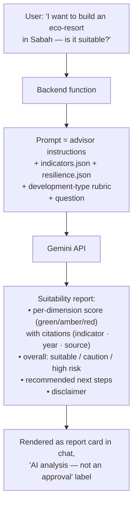
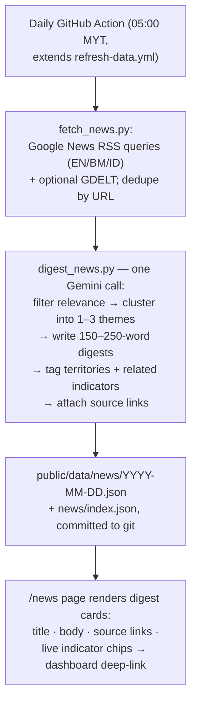

# Borneo Tracker — Additional Requirements Specification

**Project:** T002 Borneo Tracker · **Author:** Henry Chin Jian Hong · **Date:** 2026-07-07
**Status:** Draft for team requirements finalization

This document proposes three additional modules on top of the confirmed core requirements
(map, ESG indicators, SDG progress, RAG status dashboard, open data, admin back-office, mobile app).
Each module is specified with feature description, flow, acceptance criteria, and effort estimate.

| # | Module | Theme | Effort (1 person) | Runtime backend needed? |
|---|--------|-------|-------------------|-------------------------|
| AR-1 | Smart Data Intake (admin back-office) | Data governance | 2–3 weeks¹ | Yes (shared) |
| AR-2 | Development Suitability Advisor (AI chatbot) | AI interaction / decision support | Phase 1: ~2 weeks (Phases 2–3 are stretch goals) | Yes (shared) |
| AR-3 | "Borneo Pulse" AI News Digest | AI content | 1.5–2 weeks | No (build-time) |

¹ Includes the admin back-office foundation (auth, upload, DB write) which is already a **core**
requirement — the truly *additional* portion of AR-1 is ~1 week.

---

## Shared infrastructure (prerequisite for AR-1 and AR-2)

- **One small backend service** (FastAPI recommended — the data pipeline is already Python):
  handles admin auth, file upload, and LLM API proxying. Deployable free on Render/Railway/Fly.io,
  or as serverless functions (Cloudflare Workers / Vercel).
- **One LLM API key** (Google Gemini recommended: free tier covers demo traffic; Gemini Flash
  reads PDFs natively including scanned/OCR). The key lives **only** server-side / in GitHub
  Actions secrets — never in frontend code.
- **GitHub Actions secrets** must be configured on `angelyong/Borneo_Tracker`
  (bundle with the pending GFW/BPS/WAQI secrets task).

No model training or fine-tuning is required anywhere in this document. All AI features use
off-the-shelf LLM APIs with prompt-based grounding.

---

## AR-1 · Smart Data Intake — AI-assisted document extraction in the admin back-office

### Problem

18 of 86 published indicator observations (life expectancy, tourist arrivals, electrification,
mean years schooling, UNESCO sites, national parks, Brunei paddy) have **no API source** — they
come from government PDFs, press releases, and web tables. Today they are hand-typed into
`manual_overrides.csv`, which has no validation, no review step, no reminder when data goes stale,
and no way to demonstrate "data management" as a system feature.

### Feature description

The admin back-office gains a **document intake workflow**: an admin finds an official document
(e.g. the Brunei Tourism Industry Performance Report PDF), drags it into the back-office web UI,
and the system — using an LLM — extracts the target indicator value(s), shows them alongside the
**exact source sentence and page number** as evidence, lets the admin correct and confirm, and
writes the accepted observation to the database with full provenance. The public dashboard picks
it up through the existing export pipeline.

The human stays the gatekeeper: AI reads, the admin approves.

### Flow

```mermaid
flowchart TD
    A[Admin finds official document\non government website] --> B[Drag & drop file into\nadmin back-office upload zone]
    B --> C[Backend stores file +\nsends to Gemini with extraction prompt]
    C --> D["LLM returns structured draft:\nterritory · indicator · year · value · unit\n+ exact source quote + page number"]
    D --> E[Confirmation screen:\nPDF page preview (left) vs\nextracted fields (right, editable)]
    E -->|Admin edits if needed,\nclicks Accept| F[(Database: observation saved with\nuploader, timestamp, source file,\nquote, status = verified-manual)]
    E -->|Reject| G[Discarded, logged]
    F --> H[export_json.py regenerates\nindicators.json]
    H --> I[Public dashboard shows value\nwith 'Manual — verified' badge]
```

### Functional requirements

- **FR-1.1** Admin authentication required for all back-office routes (shared with core admin module).
- **FR-1.2** Upload accepts PDF, image, and HTML/URL input, max 20 MB.
- **FR-1.3** Extraction returns, per candidate observation: `territory, indicator, year, value, unit,
  source_quote, page_number`. Observations without a verbatim source quote are rejected automatically.
- **FR-1.4** Confirmation UI renders the source page and pre-fills an editable form; admin can
  amend any field before accepting.
- **FR-1.5** Validation on accept: unit must match the indicator's existing unit; value flagged if
  it deviates >50% from the previous year; year must not be in the future.
- **FR-1.6** Accepted observations are stored with provenance (admin identity, timestamp, stored
  source file, quote) and versioned — previous years are kept, never overwritten (enables trends
  for manual indicators).
- **FR-1.7** Staleness monitor: the daily refresh workflow flags any manual observation older than
  12 months; the dashboard badge changes to "Manual — due for review" and admins see a review queue.
- **FR-1.8** `manual_overrides.csv` remains as seed/fallback until the back-office is live, then is retired.

### Acceptance criteria

- [ ] AC-1.1 Uploading the real Brunei Tourism 2024 PDF extracts `678,037 arrivals, 2024` with the
      correct source quote and page, without manual typing.
- [ ] AC-1.2 An extraction error corrected by the admin in the confirmation screen is saved with the
      corrected value, not the AI draft.
- [ ] AC-1.3 A value failing validation (e.g. 753 for life expectancy) is blocked with a clear message.
- [ ] AC-1.4 An accepted observation appears on the public dashboard after export, labelled
      "Manual — verified", with the source file downloadable from the admin side.
- [ ] AC-1.5 Setting an observation's `retrieved_date` >12 months back causes the staleness badge and
      review-queue entry to appear after the next daily workflow run.
- [ ] AC-1.6 Unauthenticated requests to any intake endpoint are rejected.

### Effort & dependencies

| Work item | Estimate |
|---|---|
| Backend: auth + upload + DB write (core admin foundation) | 1–1.5 weeks |
| LLM extraction endpoint + prompt iteration | 2–3 days |
| Confirmation/review UI | 3–4 days |
| Validation + staleness monitor + export integration | 2 days |

Depends on: shared backend, Gemini key. Risk: scanned low-quality PDFs — mitigated by the
mandatory quote + human confirmation (worst case admin types manually in the same form).

---

## AR-2 · Development Suitability Advisor — AI chatbot for development-potential analysis

### Feature description

An AI assistant aimed at users evaluating **where and how sustainably an area can be developed**
(developers, investors, planners, researchers). The user asks about a territory — or, in later
phases, a specific location — and a development type (plantation, tourism, housing, industry).
The assistant analyzes the project's indicators and returns a **suitability assessment**: a
structured report scoring the relevant ESG dimensions, an overall suitability level, and guidance
on next steps.

Positioning (important): the assistant provides **informational analysis, not approval or legal
advice**. Every report carries the disclaimer *"Suitability analysis for reference only — formal
land-use decisions require the relevant authority's process (e.g. EIA/AMDAL)."* The AI's verdict
vocabulary is "suitable / suitable with caution / high risk", never "approved / rejected".

General grounded Q&A ("Which territory lost the most forest since 2015?") is included as the
baseline capability — the entire dataset (`indicators.json` + `resilience.json`, <100 KB) is
injected into each request's prompt. No training, fine-tuning, RAG, or vector DB required.

### Phased scope

| Phase | Capability | Data | Status in this proposal |
|-------|-----------|------|------------------------|
| **1** | Territory-level advisor: user picks territory + development type in chat → AI scores relevant dimensions (deforestation trend, fire risk, water access, poverty/social context, governance level) from existing indicators → suitability report + grounded free-form Q&A | Existing `indicators.json` / `resilience.json` | **Committed** |
| **2** | Location-level: user clicks a point on the map → backend queries GFW OTF geometry (forest cover, tree-cover loss, fire alerts around the point) + WDPA (protected-area overlap) → point-specific findings merged into the report | GFW (already integrated) + WDPA (free) | Stretch goal |
| **3** | Application guidance: step-by-step walkthrough of the land-use application process per jurisdiction (Sabah, Sarawak, Brunei, Kalimantan), answered **only** from a team-curated knowledge base of official steps, departments, and links | Team-researched KB (~3–5 days research) | Stretch goal |

### Flow (Phase 1)



Phase 2 inserts one step: map click → `POST /api/site-check {lat, lng}` → GFW OTF + WDPA lookup
→ point data appended to the prompt.

### Functional requirements

- **FR-2.1** Chat UI on the public dashboard, no login; conversation state client-side.
- **FR-2.2** Backend proxies all LLM calls; the API key is never exposed to the browser.
- **FR-2.3** Suitability reports score each relevant dimension with a green/amber/red level and
  cite the underlying indicator (territory, year, source) for every score.
- **FR-2.4** The assistant answers only from supplied data; questions beyond the dataset get an
  explicit "not in our data" response, not a guess. Verdict vocabulary is fixed
  (suitable / suitable with caution / high risk); "approve/reject" language is prohibited in the prompt.
- **FR-2.5** Every report ends with the reference-only disclaimer and, where relevant, points to
  the official process (EIA / AMDAL / state land office).
- **FR-2.6** Rate limiting (e.g. 10 requests/min/IP) to protect the free-tier quota.
- **FR-2.7** (Phase 2) A map-selected point returns protected-area overlap and 5 km-radius forest
  metrics from live GFW/WDPA queries, merged into the same report format.
- **FR-2.8** (Phase 3) Application-guidance answers quote only the curated KB; if the KB lacks the
  answer, the assistant says so and names the responsible authority.

### Acceptance criteria

- [ ] AC-2.1 "Is Kalimantan suitable for a new palm-oil plantation?" returns a report where the
      environment dimension reflects Kalimantan's actual deforestation/fire indicators (red/amber,
      citing real values), an overall verdict from the fixed vocabulary, and the disclaimer.
- [ ] AC-2.2 The same question for a development type with low environmental footprint (e.g.
      eco-tourism in Brunei) produces a visibly different, data-consistent assessment — the rubric
      responds to development type, not just territory.
- [ ] AC-2.3 A general data question ("Which territory has the highest poverty rate?") returns the
      correct value matching `indicators.json`, with year and source cited.
- [ ] AC-2.4 A question about data the project doesn't have (e.g. river water quality for Brunei)
      returns an explicit no-data answer — not an invented number.
- [ ] AC-2.5 No report ever contains "approved/rejected" language; every report carries the disclaimer.
- [ ] AC-2.6 No API key present in any frontend bundle or browser network request; the 11th
      request within a minute from one client is politely rate-limited.
- [ ] AC-2.7 (Phase 2) Clicking a point inside a known protected area flags the overlap in the report.

### Effort & dependencies

| Work item | Estimate |
|---|---|
| Backend proxy function + rate limit | 1–2 days |
| Advisor prompt + development-type rubric + report format iteration | 3–4 days |
| Chat UI with report-card rendering | 3–4 days |
| **Phase 1 total** | **~2 weeks** |
| Phase 2: site-check endpoint (GFW OTF + WDPA) + map integration | +1.5–2 weeks (stretch) |
| Phase 3: KB research (4 jurisdictions) + guided flow | +1–1.5 weeks (stretch) |

Depends on: shared backend, Gemini key. Cost: ~$0 at demo traffic (Gemini Flash free tier).
Risk: territory-level data cannot distinguish specific sites in Phase 1 — the report states its
geographic resolution explicitly ("assessment at Sabah state level") until Phase 2 adds point data.

---

## AR-3 · "Borneo Pulse" — AI daily news digest

### Feature description

A `/news` page publishing short daily digest posts about Borneo sustainability events
(fires, floods, deforestation, haze, economy), generated by an automated pipeline: collect
headlines from free news feeds → one LLM call filters, clusters, and summarizes **in our own
words with source links** → posts are committed as JSON and rendered by the frontend.
Runs entirely inside the existing daily GitHub Actions workflow — **no runtime backend**.

Differentiator: each post is tagged with related indicators (`fire_hotspots`, `air_quality`, …),
so the card shows the **live dashboard value** and deep-links to that map layer.
News explains the numbers; the numbers verify the news — the "data speaks" story.

### Flow



### Functional requirements

- **FR-3.1** Collection uses keyless free sources (Google News RSS primary, GDELT optional);
  queries cover all four territories in English, Bahasa Malaysia, and Bahasa Indonesia.
- **FR-3.2** Generated posts contain only claims present in the source headlines/snippets;
  output is structured JSON: `title, body, territories, related_indicators, sources[], ai_generated: true`.
- **FR-3.3** Posts summarize and link — never reproduce article body text (copyright).
- **FR-3.4** Every card displays an "AI-generated summary" label and its source links.
- **FR-3.5** Indicator tags come from a fixed vocabulary; each tag renders a chip with the current
  value from `indicators.json` linking to the relevant dashboard layer.
- **FR-3.6** Zero relevant news → zero posts for that day (no filler, no hallucination).
- **FR-3.7** Digests are committed to git — a permanent audit trail of what was generated when.
- **FR-3.8** Failure isolation: if the news step fails, the data-refresh steps still complete.

### Acceptance criteria

- [ ] AC-3.1 A day with real fire-season news in Kalimantan produces a digest post citing ≥1 real
      source URL and carrying a `fire_hotspots` chip showing the current FIRMS value.
- [ ] AC-3.2 Every factual claim in a sampled post is traceable to one of its listed sources.
- [ ] AC-3.3 An Indonesian-language source article yields an accurate English digest.
- [ ] AC-3.4 A feed of only irrelevant headlines produces zero posts.
- [ ] AC-3.5 Deleting the LLM secret causes the workflow to skip news generation while indicator
      refresh still succeeds.

### Effort & dependencies

| Work item | Estimate |
|---|---|
| fetch_news.py (RSS collection + dedupe) | 1–2 days |
| digest_news.py (prompt + JSON output, iteration) | 2–3 days |
| /news frontend page + indicator chips | 2–3 days |
| Workflow wiring + failure isolation | 0.5 day |

Depends on: Gemini key as a GitHub Actions secret on `angelyong/Borneo_Tracker`. No backend.

---

## Suggested sequencing

1. **AR-2 advisor (Phase 1)** first — stands up the shared backend + Gemini key that AR-1 reuses.
2. **AR-3 news digest** in parallel (no backend dependency; pipeline skills only).
3. **AR-1 smart intake** next — it builds on the core admin back-office work and the proven
   extraction prompting from AR-2/AR-3.
4. **AR-2 Phases 2–3** last, if time allows — the map site-check is the strongest demo moment.

Together the three modules give the project three distinct evaluation pillars:
**AI decision support** (AR-2), **AI content with data cross-verification** (AR-3), and
**AI-assisted data governance with human-in-the-loop** (AR-1).
