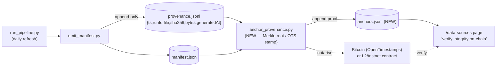

# Blockchain Anchoring — Build & Integration Spec

> **Handoff doc.** The **Blockchain workstream owns this**. **Base off `master`** (it already
> has Phase 0 + the provenance ledger + the loop fixes). **Date:** 2026-08-01.
>
> **⛔ SCOPE LINE — READ FIRST.** This is the **honest, bounded FIRST step of ABCDE's `B`**:
> anchor the data-provenance ledger on-chain so anyone can verify the published data was not
> tampered with. It is **NOT** tokenisation / RWA / carbon-credit issuance / self-sovereign
> data / community-yield. That endgame is premature, and **faking `B` in a read-only dashboard
> in front of an author-supervisor is the credibility trap the framework explicitly warns
> about.** Narrate the endgame as *horizon*; build only the anchoring.

---

## 0. What / why (ABCDE)

The framework's value chain: **measure (D) → trustworthy *without institutions* (E → B)** →
*[horizon: price/tokenise the real assets (B) → yield to the community]*.

This step is the **E → B bridge**: the sha256 provenance hashes we already publish become
**on-chain-verifiable**, so trust in the data stops depending on trusting *us*. It is the
**first real `B`** (from 0%) — and in front of the supervisor who wrote the ABCDE book, one
REAL small `B` is worth more than a faked big one.

---

## 1. Architecture (the picture)

Text: the pipeline already writes an **append-only hash ledger**; the new anchor step notarises
those hashes (or a Merkle root of them) on a public chain and records the proof; the
`/data-sources` page exposes a **verify-on-chain** surface.

---

## 2. The seam that ALREADY exists (build on this — do NOT rebuild it)

Phase 0 built the ledger **specifically as the blockchain-anchoring seam** (see the
`emit_manifest.py` docstring, "AUDIT TRAIL / BLOCKCHAIN SEAM, ABCDE letter B"):

- **`public/data/provenance.jsonl`** — append-only, **ONE JSON line per file per pipeline run**:
  `{ts, runId, file, sha256, bytes, generatedAt}`. Written by `emit_manifest.py`, **only ever
  appended, never rewritten**.
- **`public/data/manifest.json`** — current snapshot:
  `{generatedAt, runId, files:{"<repo-relative path>":{sha256, bytes, generatedAt}}}`.
- The sha256 is of the **file bytes on disk** (streamed) — not embedded in the file it describes.

**Rules already enforced — anchoring DEPENDS on them, do not break:**
> Never truncate, reorder or rewrite `provenance.jsonl`; **only append**. Only **ADD** fields to
> a line — never rename or remove one. (A rewritten log invalidates every anchor over it.)

The daily refresh appends to the ledger and regenerates the manifest. **Your work sits on top.**

---

## 3. The anchoring design

Anchor either each run's per-file hashes, or — better — a **Merkle root** over the run's
provenance entries, so **one on-chain write covers all files** of that version.

Two honest, low-cost options — pick by goal:

- **A. OpenTimestamps** *(recommended for "cheapest + honest + no keys")* — timestamp
  `manifest.json` (or the Merkle root) → get a `.ots` proof → verifiable against **Bitcoin**.
  **Free, no wallet / gas / private keys, decentralised.** Simplest and most defensible; the
  proof is a small file you commit.
- **B. Merkle root → smart contract on an L2 mainnet** *(only if you want a VISIBLE on-chain tx
  to demo)* — compute the Merkle root → submit to a tiny contract → store the `txid` + chain.
  More "blockchain-looking" (a contract and a transaction to point at), but needs a wallet/key/
  gas and a chain choice. **If you use real keys, generate them OUTSIDE the repo and store them
  as GitHub Actions secrets — never `git add` a private key.** Understand what the key buys the
  attacker: leak it and they can write hashes that make **tampered data verify**. That is the one
  attack surface option A does not have.
  > ⛔ **Not testnet.** Testnet state can be wiped and carries no economic guarantee, so a testnet
  > anchor is a mock. Presenting one as an anchor is the same credibility trap as faking `B`.
  > Free-but-real (option A) or mainnet. Nothing in between.

**Record every anchor in a new append-only file** `public/data/anchors.jsonl`, e.g.:
`{ts, method:"ots"|"chain", target:"manifest"|"merkle_root", root_or_hash, proof_ref, chain, txid?}`.
Same append-only discipline as `provenance.jsonl`.

---

## 4. The verify surface — pair it with `/data-sources`

- Expose verification on the **`/data-sources`** page. It is a **placeholder today**; the real
  transparency page (per-indicator source / year / confidence) lives on
  **`feature/figma-redesign` (`DataSources.jsx`)** — **port it**, then add a
  **"verify data integrity on-chain"** panel: each data file's sha256, when/how it was anchored,
  and a documented one-click way to verify against the chain (OTS verify, or the tx on a block
  explorer).
- Honest wording: **"data integrity anchored on-chain"** — NOT "decentralised ownership" /
  "tokenised" / "self-sovereign."

---

## 5. ABCDE framing + the HARD LINE

- ✅ **Do:** anchor provenance, provide verification, narrate as a **tamper-evident**,
  institution-independent audit trail = a real, honest `B`.
  > **Say "tamper-evident", never "tamper-proof" or "immutable."** NIST (NISTIR 8202) is explicit
  > that blockchains are *"tamper evident and tamper resistant… cannot be considered completely
  > immutable."* The weaker word is the true one, and using it is the kind of precision an
  > author-supervisor will notice.
- ✅ **Also say what it does NOT prove.** The UI must state plainly that anchoring says the bytes
  have not changed, **not** that the numbers are correct — a wrong source is preserved just as
  faithfully as a right one. This is not a disclaimer to bury; it is the most persuasive thing on
  the page, and omitting it implies "on-chain therefore true", which is exactly the reasoning that
  made tokenised carbon credits worthless.
- 🚫 **Do NOT (this build):** tokens, RWA, carbon-credit issuance, self-sovereign / DID data,
  community-yield. Those are the **endgame** — narrate as horizon, never claim as built. Faking
  them is the credibility trap. `B` is still ~0%; this step is what honestly moves it off zero.

---

## 6. Build checklist (in order)

**Status: built on `feature/blockchain-anchoring`.** Method chosen = **A, OpenTimestamps**, plus
GitHub `actions/attest` (Sigstore) as a second, independent witness. Both are free and neither
needs a key or a funded wallet.

1. [x] Decide method — **OpenTimestamps** (no keys), with Sigstore alongside it. Polygon stays
       available as an additive third witness; see §3.
2. [x] `merkle.py` — RFC 6962 root over the ledger, recomputable by anyone from the served file.
3. [x] `ots.py` — the `.ots` wire format, calendar submit and upgrade, standard library only.
       (The reference package needs `python-bitcoinlib`, which fails on Windows.)
4. [x] `anchor_provenance.py` — stamps **`manifest.json`**, which already commits to every data
       file, so one proof covers all of them and the official `ots verify` works unmodified.
       Idempotent: unchanged data is a no-op.
5. [x] `upgrade_anchors.py` — **separate on purpose**; see the pending-proof note below.
6. [x] `verify_anchor.py` — `--remote` verifies what production is actually serving.
7. [x] `.github/workflows/anchor.yml` (after "Refresh dashboard data") and
       `anchor-upgrade.yml` (every 6 h).
8. [x] `useIntegrity.js`, `IntegrityChip.jsx`, `DataVerification.jsx` on `/data-sources`,
       en + ms strings, chip wired into Overview.
9. [x] Golden tests — `test_anchoring.py` and `src/data/useIntegrity.test.js`.
10. [ ] Port the real data-sources content from `feature/figma-redesign` (`DataSources.jsx`) and
        merge it with the verification panel. **Deliberately deferred** — "where the data comes
        from" and "has the data been altered" are two different questions, and porting a page
        across branches is a separate merge risk.

### Five things that will bite you (learned building it)

1. **A fresh OTS stamp is PENDING, for hours.** It is a calendar's promise, not a Bitcoin proof —
   measured here, still pending after 24 minutes. **You cannot stamp and verify in one CI run.**
   Hence the separate upgrade workflow, and hence the amber `Timestamping…` chip state. Do not
   render that as an error.
2. **The browser must hash RAW BYTES.** `arrayBuffer()` + `crypto.subtle.digest`, never
   `JSON.parse` → `JSON.stringify` — key order, whitespace, number formatting and the trailing
   newline all change and the hash will never match. Anything that rewrites bytes in transit (CDN
   JSON minification, line-ending conversion, a BOM) breaks it too; commit `3978363` pinned
   `manifest.json` to LF for exactly this class of problem.
3. **Anchor only when the data changed.** `refresh-data.yml` already gates its commit on that;
   `anchor_provenance.py` is idempotent for the same reason. "Daily" anchoring would fill the log
   with identical hashes and destroy its usefulness as a record of distinct versions.
4. **`crypto.subtle` needs a secure context.** On plain http it is absent, and the honest answer
   is the grey `Not verified` state — never a green one.
5. **The chain does not constrain us, the repo does.** Anchoring is only meaningful if
   `provenance.jsonl` cannot be rewritten. **`master` still allows force-push and no commit is
   signed.** Branch protection + signed commits are free and are a genuine prerequisite, not a
   nicety — see `BLOCKCHAIN_B_RESEARCH.md` §7.

---

## 7. Coordination / conflict-avoidance

- **Base off current `master`** (has Phase 0 + provenance ledger + Food fix + news fix +
  resilience-watch). `git merge origin/master` first if your branch is behind.
- **Files this touches:** new `anchor_provenance.py`, new `.github/workflows/anchor.yml`, new
  `public/data/anchors.jsonl`, the `/data-sources` route in `src/App.jsx` + a real DataSources
  page (ported from `feature/figma-redesign`), maybe `verify_anchor.py`.
- ⚠️ **`emit_manifest.py` / `provenance.jsonl` format is the anchoring CONTRACT** — prefer NOT to
  change it; if unavoidable, **ADD fields only** (never rename / remove / reorder) or past
  anchors break.
- ⚠️ **`src/App.jsx`** — additive route only; `/data-sources` real page is on
  `feature/figma-redesign` — expect a small port + merge.
- Does **NOT** need `compute_resilience.py` / `run_pipeline.py` / `resilienceModel.js` →
  **no clash with the Impact Simulator build** (aichatbot workstream).
- Anchor **after** the daily refresh (it appends provenance + regenerates the manifest first).

---

## 8. Reference facts (verified in the repo, 2026-08-01)

- **The ledger:** `emit_manifest.py` writes `public/data/manifest.json` (overwrite) +
  `public/data/provenance.jsonl` (append-only). Line schema:
  `{ts, runId, file, sha256, bytes, generatedAt}`. This is loop-engineering item **"D13"** and
  is explicitly the blockchain seam.
- **ABCDE `B` row:** "trust without institutions; tokenise Real-World Assets; self-sovereign
  data" — but **only the immutable-audit-trail / anchoring part is in scope now.**
- **Value chain + endgame warning:** `.claude/skills/borneo-abcde-framework` §2 (value chain)
  and §3 ("Faking B … is a credibility trap in front of an academic/author supervisor").
- **`/data-sources` real page:** `feature/figma-redesign` → `DataSources.jsx`.
- **Sister handoff / house style:** `docs/IMPACT_SIMULATOR_SPEC.md`, `docs/LOOP_ENGINEERING_PLAN.md`.
