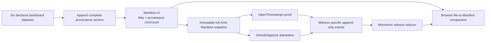

# Blockchain Phase 1 — Evidence-Backed Completion Plan

> **Status:** historical implementation handoff and evidence baseline. Local implementation has
> since progressed; use `BLOCKCHAIN_PHASE1_IMPLEMENTATION_STATUS_2026-08-09.md` for the current
> release state.
> **Audited:** 2026-08-09 (Asia/Kuala_Lumpur).
> **Branch audited:** `feature/blockchain-anchoring` at `aa56435`.
> **Purpose:** replace assumption-based planning with a plan tied to reproducible repository evidence and authoritative upstream documentation.

---

## 1. Decision

The Phase 1 direction is technically workable, but the current branch is **not Phase-1-complete**.

The correct Phase 1 remains:

> Publish a versioned manifest of the dashboard datasets, commit the provenance-ledger prefix inside that manifest, timestamp the exact manifest bytes with OpenTimestamps, attest the same bytes with GitHub/Sigstore, and expose an honest verification surface.

This serves the Borneo Tracker `D + E -> B` bridge:

- **D — Data:** the published datasets and their file hashes.
- **E — Ethics:** source/provenance history, explicit confidence limits, and non-misleading claims.
- **B — Blockchain:** an external timestamp witness for the manifest bytes.
- **Who it serves:** reviewers, researchers, regulators, investors, and ESG/data customers who need a reproducible audit trail.

Phase 1 does **not** include tokens, wallets, smart contracts, RWA issuance, carbon-credit issuance, DID/self-sovereign identity, or community yield.

---

## 2. Evidence standard used for this plan

Every blocking item below is backed by at least one of:

1. An exact current-code path.
2. A reproducible local command and observed result.
3. Current GitHub Actions/public-production state.
4. Authoritative OpenTimestamps or GitHub documentation.

Recommendations are labelled as recommendations. Facts and observed failures are not presented as guesses.

### Reproduced baseline

| Check | Observed result |
|---|---|
| Branch relation | `origin/master...HEAD` = **1 behind / 9 ahead**; missing master commit is a scheduled data refresh |
| Blockchain Python tests | `python test_anchoring.py` — all golden checks passed |
| Frontend integrity tests | `npm test -- --run src/data/useIntegrity.test.js` — **9/9 passed** |
| Production build | `npm run build` — passed |
| Full JS suite | **703 passed / 16 failed**; failures are AI-chat expectations pinned to older data, not Blockchain tests |
| Lint | 15 errors under generated `server/dist` files |
| Clean install | `npm ci --dry-run --ignore-scripts` fails because `package.json` and lockfile are out of sync |
| GitHub anchor runs | Public Actions API lists no Anchor/Upgrade workflow; those workflow files are not on the default branch |
| Production manifest | Served successfully, but is dated `2026-08-05T22:23:34Z` |
| Production anchor/proof data | `/data/anchors.jsonl` and `/data/resilience_model.json` currently return SPA HTML, not the requested files |

The full-suite, lint, lockfile, and production-deployment issues are real release concerns, but they are separated from Blockchain Phase 1 code correctness later in this document.

---

## 3. Corrections to the earlier draft plan

These corrections must replace the earlier statements; the superseded statements must not be carried into implementation.

| Earlier statement | Evidence-backed correction |
|---|---|
| The ledger root is already anchored because it appears in `anchors.jsonl`. | **False.** The OTS proof commits only to `manifest.json`; `ledgerRoot` is stored in a self-hosted event. The root must be included inside the stamped Manifest. |
| Adding `resilience_model.json` or GeoJSON to the Manifest will automatically make the current smoke test fail. | **Incorrect execution-path analysis.** `verify_manifest.py` currently builds the remote expected snapshot from only three required files, so extra Manifest entries are silently excluded from remote verification. The fix is still required, but the present failure mode is **omission**, not automatic rejection. |
| Ordinary GitHub-hosted CI can run a complete official `ots verify`. | **Not without additional infrastructure.** The official client states that full verification needs a Bitcoin Core node; a pruned node is acceptable. Hosted CI can check official-format compatibility, but full chain verification needs the official browser verifier or a maintained node. |
| Saving the Sigstore bundle is sufficient for durable offline verification. | **Incomplete.** A bundle supports online/local verification, but true offline verification also requires a trusted-root snapshot and rotation/revocation policy. Bundle archival is durability hardening, not the basic online Phase 1 gate. |
| The Figma branch contains a complete per-indicator Data Sources/provenance page. | **False.** `origin/feature/figma-redesign:src/pages/info/DataSources.jsx` is six static source cards. A real source/year/data-level/confidence surface still has to be designed or kept separate from `/data-integrity`. |
| Signed commits are an unconditional Phase 1 prerequisite. | **Too strong.** Current human and bot commits are unsigned, and requiring signatures immediately would block the current automation. No force-push/deletion, PR review, required checks, and restricted workflow changes are required governance; signed commits need a bot-compatible design first. |
| The browser currently verifies Bitcoin. | **False.** It hashes files, then trusts `anchors.jsonl.status`. It does not parse the `.ots` proof or validate Bitcoin inclusion. UI wording must reflect that boundary. |

---

## 4. Verified P0 defects in the current implementation

### 4.1 The provenance ledger is not externally committed

Evidence:

- `anchor_provenance.py:22-28` explicitly says the ledger root is recorded but not anchored.
- `emit_manifest.py:89-103` produces a Manifest with `generatedAt`, `runId`, and `files`, but no ledger root/count.
- `anchor_provenance.py:206-224` writes `ledgerRoot` only into `anchors.jsonl`.
- The current OTS proof digest exactly equals the current Manifest SHA-256.

Reproduction result:

```text
manifest_has_provenance_commitment = False
proof_digest == manifest_digest     = True
ledger_root_only_in_self_hosted_event = 61ed5380...
```

Impact: an operator able to change both `provenance.jsonl` and `anchors.jsonl` can rewrite the ledger without invalidating the external OTS proof.

### 4.2 The verifier reports PASS when no anchor exists

Evidence:

- `verify_anchor.py:153-157` returns the existing `failed` value when `anchors.jsonl` is missing.
- `verify_anchor.py:168-172` does the same for an unanchored Manifest.
- `verify_anchor.py:228-241` prints `RESULT: PASSED` whenever that value is false.

Reproduced with a source that served all current data but simulated a missing `anchors.jsonl`:

```text
failed = False
warn: anchors.jsonl simulated missing — this data version carries no anchor here yet
```

Impact: absence of proof can be reported as successful proof verification.

### 4.3 Custom OTS “confirmed” is structural, not Bitcoin verification

Evidence:

- `ots.py:27-30` explicitly says it does not verify a Bitcoin attestation against the chain.
- `ots.py:468-476` returns `confirmed` when it parses a Bitcoin attestation tag and block height.
- `verify_anchor.py:201-205` displays that height as a Bitcoin block.

Reproduced by constructing a syntactically valid attestation for a made-up height without consulting a node, block header, transaction, or Merkle inclusion:

```text
custom_status = ('confirmed', [999999999])
```

Impact: the custom status can only mean “the proof contains a Bitcoin attestation claim.” It cannot mean “Bitcoin inclusion was independently verified.”

### 4.4 Browser verification can become green with zero checked files

Evidence:

- `src/data/useIntegrity.js:18-23` checks only `indicators.json` and `resilience.json`.
- `src/data/useIntegrity.js:143-156` filters out Manifest entries that are missing.
- When `files=[]`, no mismatch/unreachable condition is true; a self-log event with `status=confirmed` reaches `VERIFIED` at `:179-190`.
- District/model/geometry inputs are fetched by `src/data/useIndicators.js:135,180,214,243` but are not covered by the global badge.
- Corrupt `anchors.jsonl` lines are silently discarded at `useIntegrity.js:66-76`.

Impact: a malformed or incomplete Manifest can produce a confident badge without verifying the data being described.

### 4.5 Witness state is lost when the last event wins

Evidence:

- `upgrade_anchors.py:42-54` and `src/data/useIntegrity.js:79-85` replace all prior state with the last event.
- The upgrade event at `upgrade_anchors.py:120-134` omits Sigstore.
- `anchor.yml:54-61` creates Sigstore before running the anchor script.
- `anchor_provenance.py:182-185` exits early for an existing Manifest before it reads the new bundle at `:221-224`.

Reproduction with a pending+Sigstore event followed by a confirmed OTS upgrade:

```text
latest = {'type': 'upgrade', 'status': 'confirmed'}
sigstore_preserved = False
```

### 4.6 `--force` can downgrade and overwrite a confirmed proof

Evidence:

- `anchor_provenance.py:182-185` bypasses the existing-anchor guard with `--force`.
- `:191-204` creates and writes a fresh proof to the same digest-derived path.
- The new proof starts pending and a new pending event becomes the latest event.

Impact: a confirmed proof can be replaced by a weaker pending proof. `--force` is unsafe in its current form.

### 4.7 The standard latest proof alias is not staged by automation

Evidence:

- Stamp writes `public/data/manifest.json.ots` at `anchor_provenance.py:200-204`.
- Upgrade updates it at `upgrade_anchors.py:110-118`.
- Both workflows stage only `public/data/anchors.jsonl` and `public/data/anchors` (`anchor.yml:79`, `anchor-upgrade.yml:44`).

Impact: the documented `/data/manifest.json.ots` can remain stale or pending even after the content-addressed proof was updated.

### 4.8 Historical proofs have no historical Manifest bytes

Evidence:

```text
6b4660... proof: current digest, no version snapshot
9cd31c... proof: old digest, no version snapshot
e533d6... proof: old digest, no version snapshot
```

Only the current `manifest.json` is retained. An old `.ots` proof needs the exact old Manifest bytes to verify its file digest. The short proof filename also does not form the `FILE` / `FILE.ots` pair expected by the official CLI.

### 4.9 Workflow execution is not an exact-SHA chain

Evidence:

- `anchor.yml` and `deploy.yml` both listen to `Refresh dashboard data` completion.
- Both check out a branch tip rather than a release artifact or exact post-refresh SHA.
- They can run in parallel and see different branch tips.
- GitHub documents that a `GITHUB_TOKEN` push does not start a new workflow, except explicit `workflow_dispatch`/`repository_dispatch` events.

Impact: new data can deploy before its proof, and a proof commit does not automatically cause a second deploy.

### 4.10 Remote verification silently excludes Manifest entries

Evidence:

- `emit_manifest.py:53-58` declares four files, including `resilience_model.json`.
- `verify_manifest.py:17,88-101` reduces the deployment expected snapshot to indicators, resilience, and districts.
- `deploy.yml:982-999` downloads and checks the same three data files.
- The inline Manifest helper contains broader logic, but its `verify-local` path is not invoked; the actual expected snapshot comes from `verify_manifest.py`.

Impact: a deployment can pass its remote check without remotely verifying `resilience_model.json` or any newly declared dataset.

### 4.11 Evidence that the corrected path is feasible

The plan is not based only on defect discovery. The core replacement path was also exercised:

- `merkle.py`'s domain-separated RFC6962-style construction passes its independent golden vector, ordering, odd-leaf, empty-tree, and line-ending checks.
- The official OpenTimestamps Python library successfully deserialized the current `manifest.json.ots` as SHA-256 and returned digest `6b4660a93671435b5e76a5a578bc11ab966bb2fb2b83bf2fa861ee23b1de7d4e`, exactly matching the current Manifest SHA-256. This establishes wire-format interoperability, not Bitcoin inclusion.
- A read-only in-memory calendar upgrade of the current proof changed it from pending to Bitcoin-attestation claims at heights `961427`, `961429`, and `961453`. Other stored proofs also received calendar upgrades. This proves the current calendar submission/upgrade path is live; it still does not replace verification against Bitcoin headers.
- Embedding the ledger root in Manifest v2 creates no hash cycle: current provenance entries contain data-file metadata/hashes, not the Manifest hash. The completed ledger prefix can therefore be hashed first and included in the Manifest that is stamped afterward.
- The current `actions/attest-build-provenance@v2` action definition does expose `bundle-path`, so the existing bundle handoff is real. Current GitHub guidance consolidates new work on `actions/attest@v4`.
- GitHub officially supports `workflow_call`, `workflow_dispatch`, and `repository_dispatch`; the latter two are documented exceptions to normal `GITHUB_TOKEN` trigger suppression. An explicit exact-SHA chain therefore does not require a speculative PAT workaround.

---

## 5. Correct Phase 1 target architecture



Trust boundary:

- The browser can independently confirm that downloaded file bytes match the downloaded Manifest.
- `anchors.jsonl` helps discover proof state but is **not** an independent witness.
- OTS becomes independent only when the proof is verified against Bitcoin using the official browser verifier or a client backed by Bitcoin Core.
- Sigstore becomes meaningful when the signature and expected repository/workflow/ref identity are verified.
- None of these mechanisms proves that the source number was correct.

---

## 6. Implementation work packages

The packages below are ordered. `P1-01` etc. are sequence identifiers, not severity labels; the verified defects above remain P0 blockers. Do not start a later package while an earlier contract is still changing.

### P1-01 — Freeze Manifest v2 and integrity scope

**Files:** `emit_manifest.py`, `verify_manifest.py`, `validate_data.py`, new schema fixtures/tests.

Define one authoritative Phase 1 dataset scope:

1. `public/data/indicators.json`
2. `public/data/resilience.json`
3. `public/data/resilience_model.json`
4. `public/data/districts.json`
5. `public/data/borneo_districts.geojson`
6. `public/data/brunei.geojson`

The GeoJSON files are included because they are fetched as live dashboard inputs. Metadata files such as Manifest, provenance, and anchors are not datasets in this scope.

Manifest v2 minimum contract:

```json
{
  "schemaVersion": 2,
  "generatedAt": "RFC3339 UTC",
  "runId": "workflow run or local identifier",
  "dataVersion": "sha256 of canonical sorted path/hash/byte descriptors",
  "files": {
    "public/data/example.json": {
      "sha256": "64 lowercase hex",
      "bytes": 123,
      "generatedAt": "source generation date or null"
    }
  },
  "provenance": {
    "algorithm": "rfc6962-sha256-jsonl-v1",
    "root": "64 lowercase hex",
    "entries": 85
  }
}
```

Validation must reject duplicate JSON keys, unknown/unsafe paths, traversal, invalid digests, negative/non-integer byte counts, and an empty dataset scope.

**Acceptance:** all six declared paths exist; modifying one byte changes the relevant file hash and `dataVersion`; zero/unknown entries fail validation.

### P1-02 — Make Manifest generation idempotent and commit the ledger prefix

**Files:** `emit_manifest.py`, `merkle.py`, the dataset writers called by `run_pipeline.py`, `test_anchoring.py`, new integration tests.

Correct generation order:

1. Hash and validate all declared datasets.
2. Calculate deterministic `dataVersion` from canonical UTF-8 JSON containing sorted `{path, sha256, bytes}` descriptors, fixed key order, compact separators, forward-slash paths, and no timestamps. Commit a fixed golden vector for this serialization.
3. Treat “unchanged” at two levels:
   - Dataset generators compare substantive content without volatile `generatedAt` fields and preserve the prior file bytes/timestamp when values did not change.
   - `dataVersion` still identifies the **exact published bytes**. If exact bytes really changed, it is a new version even if the business values happen to be equal.
4. If the ledger, current Manifest, and exact file bytes already describe the same complete version, preserve the existing Manifest bytes and append nothing.
5. Prepare the current run's provenance entries in memory, including `dataVersion`, entry index, and entry count.
6. Hold one single-writer lock across provenance append, flush/fsync, batch reread/validation, root calculation, and atomic Manifest publication. Release it only after the Manifest durably references the committed prefix.
7. Only after that may anchoring begin.

Historical verification must compute the root over the **first `provenance.entries` lines**, not the current full ledger. Later legitimate appends change the full root but must not invalidate an older Manifest.

Startup/recovery rules are mandatory:

- Ledger and Manifest reference the same complete version/root/count: normal no-op or next version.
- A complete ledger tail exists but the Manifest still references the earlier prefix: if the current exact files match that tail, reconstruct and atomically publish the missing Manifest; otherwise fail with an explicit recovery requirement. Do not append the version again.
- An incomplete tail exists: fail closed and invoke a documented append-only recovery procedure; never silently anchor or discard it.

This avoids the crash window where an append succeeds but the Manifest write fails and the old Manifest remains permanently behind the ledger.

**Acceptance:** current run root/count is inside the exact bytes being stamped; repeated substantively unchanged generation preserves dataset bytes and becomes a byte-for-byte no-op; complete-unreferenced and incomplete-tail crash fixtures follow the recovery rules; a modified/deleted/reordered committed entry invalidates the relevant prefix root.

### P1-03 — Preserve versioned Manifests and monotonically upgradable proofs

**Files:** `anchor_provenance.py`, `upgrade_anchors.py`, workflows, verifier.

For each new Manifest SHA-256, preserve:

```text
public/data/versions/<full-manifest-sha>/manifest.json
public/data/versions/<full-manifest-sha>/manifest.json.ots
```

Requirements:

- Use the full 64-character digest in paths.
- Manifest snapshot bytes are immutable and must exactly equal the bytes that were stamped.
- The paired `.ots` file is **not immutable**: it is monotonically and atomically replaced as it moves pending -> confirmed. An upgrade must merge/strengthen the existing proof and can never downgrade it.
- Every OTS event records the proof-file SHA-256 before/after the relevant operation so proof revisions are auditable.
- Preserve latest aliases:
  - `public/data/manifest.json`
  - `public/data/manifest.json.ots`
- Both version proof and latest alias must be staged/committed when changed.
- Anchor events record the exact source commit SHA and workflow run identity. The proof commit SHA is emitted by the workflow **after** committing and is passed to deploy; it cannot be embedded in the same event because that would create a commit-hash circular dependency.
- Proof paths are constrained to the version directory; traversal is rejected.

Legacy migration is required for the three recorded v1 proofs. Recover the exact Manifest blobs from Git and verify their digest before creating the version pair:

| Manifest SHA-256 | Verified source commit |
|---|---|
| `e533d68fd34741bd13f0f458cff83e6ea3cd5cb8479a166612541871e7ad3e30` | `d9d6d4093f350f3734a880573d47079b1d5850de` |
| `9cd31c46f08e85e9dfa77bc6dd95cb36f04d187995e5e3cbded580c5a8df283a` | `a9e18b1449222109baf020115c5ed7f4d26aaebb` |
| `6b4660a93671435b5e76a5a578bc11ab966bb2fb2b83bf2fa861ee23b1de7d4e` | `aa564351a9647cc5c136db8672bf5fb8172cfdf6` |

The migration must hash-check each recovered blob, pair it with its existing proof, and append a migration event; it must not edit old events. Old data payloads do not need to be duplicated in Phase 1. The history UI must say it stores historical Manifest/proof records, not a full historical data archive.

**Acceptance:** official tooling can be given an exact `manifest.json` / monotonically upgraded `manifest.json.ots` pair for all three migrated v1 versions and every schema-v2 version.

### P1-04 — Replace last-event-wins with a monotonic witness reducer

**Files:** `anchor_provenance.py`, `upgrade_anchors.py`, `verify_anchor.py`, `src/data/useIntegrity.js`, tests.

Introduce schema-v2 witness-specific events, for example:

```json
{
  "schemaVersion": 2,
  "manifestSha256": "...",
  "eventType": "ots.stamped | ots.upgraded | sigstore.attested",
  "witness": { "type": "ots | sigstore", "status": "pending | attested | confirmed" },
  "proof": "safe relative path",
  "sourceCommitSha": "...",
  "ts": "..."
}
```

Reducer rules:

- OTS and Sigstore accumulate independently.
- `confirmed` cannot be downgraded to `pending`.
- An OTS upgrade cannot remove Sigstore.
- A later Sigstore event can augment an existing OTS anchor.
- Duplicate events are idempotent.
- Legacy flat events remain readable through an explicit migration adapter.
- Corrupt/unknown events produce `INVALID_METADATA`; they are not silently discarded.

Remove `--force` for Phase 1. If a future restamp feature is needed, it must merge proof branches and preserve the strongest confirmed state rather than overwrite it.

**Acceptance:** stamp+Sigstore+upgrade yields both witnesses; repeated execution changes nothing; no operation can downgrade a confirmed proof.

### P1-05 — Make verifier results truthful and policy-driven

**Files:** `verify_anchor.py`, `ots.py`, tests, verification documentation.

Required result states:

| Result | Meaning |
|---|---|
| `VERIFIED_CONFIRMED` | Files match Manifest, Manifest matches proof subject, and required external verification policy passed |
| `PENDING` | File/Manifest binding passes; OTS is not yet externally confirmed |
| `UNANCHORED` | No event/proof exists for the current Manifest |
| `MISMATCH` | A file, Manifest, ledger prefix, or proof subject differs |
| `INVALID` | Schema, event log, path, or proof is malformed |

CLI policies:

- Default and `--require-confirmed`: only `VERIFIED_CONFIRMED` exits `0`.
- `--allow-pending`: a correctly bound pending proof also exits `0`, but unanchored never does. This is the explicit policy for the immediate post-stamp job.
- Fixed exit codes: `0` active policy satisfied; `2` pending but disallowed; `3` unanchored; `4` mismatch; `5` invalid/tool error.
- Never print `PASSED` for `UNANCHORED` or a state disallowed by the active policy.

Rename the custom OTS status internally to reflect what it proves, such as `bitcoin_attestation_present`. Do not call it chain-verified.

Official verification policy:

- Hosted CI: parse the proof using the official OpenTimestamps library/`ots info` compatibility path and confirm the subject digest.
- Full Bitcoin verification: use the official OpenTimestamps browser verifier, or `ots verify` on a maintained Bitcoin Core node (pruned is acceptable).
- Do not claim that an arbitrary block-explorer link is equivalent to cryptographic OTS verification.

**Acceptance:** simulated missing anchor is non-success; a forged syntactic Bitcoin-height attestation is not `VERIFIED_CONFIRMED`; official library parses the generated proof and sees the exact Manifest digest.

### P1-06 — Make the frontend scope-aware and honest

**Files:** `src/data/useIntegrity.js`, `IntegrityChip.jsx`, `DataVerification.jsx`, EN/MS copy, tests.

Required behavior:

- Verification accepts an explicit required-file scope.
- Overview, district, model/simulator, and full verification page scopes are defined explicitly.
- The full verification page checks all six Manifest datasets.
- Missing required Manifest entries, zero checked files, corrupt events, or unknown schema can never become green.
- Reuse already-fetched raw bytes or a shared cache where possible; do not redownload large GeoJSON on every route solely for hashing.
- File mismatch remains red.
- Network/proof absence remains grey/unverified, not green and not “tampering.”

Automatic badge wording must describe what the browser actually did, for example:

> Published files match the published Manifest.

It must not automatically say “Bitcoin verified,” “independent of us,” or “unchanged including by us” merely because `anchors.jsonl` says confirmed.

Witness cards must distinguish:

- OTS proof available/pending/attestation recorded.
- Independent verification instructions.
- Sigstore attestation available and its verification policy.

Remove Polygon from the active witness denominator and cost tile. Polygon is roadmap-only in Phase 1.

Retain prominently:

> This verifies published bytes, not whether the source numbers are correct.

**Acceptance:** zero files cannot green; district/model tests cover their inputs; corrupt event log is invalid/unverified; UI never represents self-hosted status as independent chain verification.

### P1-07 — Complete Sigstore identity verification

**Files:** `anchor.yml`, event schema/reducer, verification docs.

Use the current consolidated GitHub action rather than starting new work on the old wrapper. At audit time, the current release was:

```text
actions/attest@v4.2.2
commit 1e69f48acb82d1966a394da916b4c1698aa569d6
```

Record the action outputs needed for discovery, including attestation ID/URL. Do not treat the presence of parsed `logIndex` metadata as signature verification.

Connected verification must use `gh attestation verify` and constrain identity, ideally including:

- repository: `angelyong/Borneo_Tracker`
- signer workflow: `.github/workflows/anchor.yml` or the final trusted reusable workflow
- source ref: `refs/heads/master` for a release attestation
- expected source digest when performing a release check

Recommended least privilege:

- Attestation job: `contents: read`, `id-token: write`, `attestations: write`.
- Separate proof-commit job: only the contents permission needed to commit proof artifacts.
- Pass attestation ID/URL as job outputs. If the bundle is needed by the commit job, transfer it as a short-lived workflow artifact and verify its SHA-256 before parsing; do not assume files automatically cross job boundaries.
- If a reusable workflow performs signing, its path—not merely the caller workflow—is the signer identity that `gh attestation verify --signer-workflow` must enforce.

Optional durability hardening:

- Archive a full-SHA-named bundle with the version snapshot.
- If true offline verification is required, also define trusted-root snapshots and a rotation/revocation update policy.

**Acceptance:** a connected same-repository run creates an attestation and `gh attestation verify` passes with the expected workflow/ref policy. This cannot be honestly proven only by local unit tests.

### P1-08 — Replace parallel branch-tip workflows with an exact-SHA chain

**Files:** `refresh-data.yml`, `anchor.yml`, `anchor-upgrade.yml`, `deploy.yml` or a new release orchestrator.

Required topology:

```text
refresh + validate + commit
        ↓ exact pushed SHA
anchor exact SHA + commit proof
        ↓ exact proof commit SHA
deploy exact proof commit SHA
        ↓
remote byte/proof verification
```

Recommended implementation:

1. Use a top-level release/anchor workflow for the Sigstore signing step. Do **not** assume that checking out SHA B inside a reusable workflow changes the OIDC source identity inherited from a workflow that started at SHA A.
2. After refresh pushes data commit B, trigger a new top-level run through an explicit supported mechanism. `repository_dispatch` with `client_payload.sha=B` is valid because GitHub documents it as a `GITHUB_TOKEN` exception.
3. Before attesting, require the dispatch run's `github.sha` and current `master` to equal the requested B. If the branch moved, fail safely and enqueue/catch up rather than signing B under an unexplained source identity.
4. Record B separately as `dataCommitSha`; Sigstore verification must enforce the real top-level signer workflow, source ref, and actual source digest from that new run.
5. Anchor that exact data commit.
6. If proof artifacts create a new commit, return that exact proof commit SHA.
7. Deploy through a reusable deploy contract using only that returned SHA.
8. Remove the parallel `Refresh -> Deploy` route for data releases.
9. When the scheduled upgrade commits a confirmed proof, publish/deploy that exact new proof commit as well.

Concurrency and catch-up:

- Serialize the complete publication-critical section—not only the final anchor and upgrade writes—under the same cross-workflow release/proof-write concurrency key.
- Use current GitHub `queue: max` semantics so multiple pending versions queue instead of the default behavior that replaces an older pending run. Do not combine it with `cancel-in-progress: true`.
- Add a catch-up scan that compares committed Manifest versions/events and anchors any exact version missed by an interrupted/rejected run. Queue capacity is finite and is not itself proof that no version was skipped.
- Catch-up recovers exact Manifest bytes from the recorded Git data commit and hash-checks them before stamping. If Sigstore attests a missed historical artifact from a later recovery run, record both `dataCommitSha` and the actual recovery signer/source digest; never imply that the later OIDC identity was bound to the old commit.
- A non-fast-forward push fails safely; do not force-push. Retry/rebase only after revalidating the target Manifest.

No PAT is required merely to work around trigger suppression; supported explicit dispatch/reusable workflow mechanisms exist.

**Acceptance:** a fixture workflow test proves that data commit SHA B is anchored, proof commit SHA C is produced, and only C is handed to deploy; three queued publication fixtures are all processed rather than replacing the middle one; catch-up finds a deliberately interrupted version; concurrent anchor/upgrade runs cannot overwrite each other.

### P1-09 — Make local and remote deployment verification Manifest-driven

**Files:** `verify_manifest.py`, `deploy.yml`, `refresh-data.yml`, `tests/test_manifest_integrity.py`, deployment docs.

Use one canonical validated Manifest reader. Remove the divergence between:

- `emit_manifest.py` tracked files,
- `verify_manifest.py` three-file `REQUIRED_FILES`,
- hardcoded refresh staging,
- hardcoded smoke downloads,
- the unused broader inline helper.

Required behavior:

- The validated Manifest scope drives local verification.
- The same expected snapshot drives remote downloads.
- Smoke dynamically downloads and hashes every safe declared dataset.
- Refresh stages all declared generated dataset/Manifest/provenance files when the data version changes.
- `manifest.json.ots`, the current version snapshot/proof, and event log are included in the proof-publication contract.
- SPA HTML fallback is rejected for every expected data/proof URL.

This is code compatibility work for Phase 1. Actual SFTP/FTPS deployment remains a later stage in the agreed sequence.

**Acceptance:** deleting or altering any one of the six remote fixture files fails smoke verification; adding a validated Manifest entry automatically adds it to the check without another hardcoded list.

### P1-10 — Add missing integration, security, and workflow tests

Required tests:

1. Data files -> provenance batch -> Manifest v2 -> snapshot -> stamp -> upgrade -> verify.
2. Ledger prefix root is inside the exact stamped Manifest.
3. Historical prefix remains valid after later ledger appends.
4. Missing anchor is not PASS.
5. Pending, unanchored, mismatch, invalid, and confirmed policies/exit codes.
6. Syntactic Bitcoin attestation alone is not full confirmation.
7. Official OpenTimestamps library parses generated proof and exact digest.
8. `--force` is absent or cannot downgrade/overwrite confirmed proof.
9. Latest `manifest.json.ots` is updated and staged.
10. Historical Manifest/proof pairs exist under full SHA.
11. Sigstore survives OTS upgrade and can be added later.
12. Corrupt/unknown events invalidate automatic state.
13. Zero checked files cannot green.
14. District/model/full-scope UI verification.
15. Manifest/event path traversal, duplicate keys, invalid digests, and unsupported schema.
16. Exact-SHA workflow contract and shared concurrency.
17. Remote Manifest-driven fixture, including SPA HTML fallback.
18. Complete-unreferenced ledger tail and incomplete-tail crash recovery.
19. Substantively unchanged data preserves published bytes despite volatile generation time.
20. Legacy migration digest checks for all three v1 Manifest/proof pairs.
21. Proof SHA changes only through a monotonic pending -> confirmed upgrade.
22. Sigstore OIDC/source identity test distinguishing triggering SHA, data commit SHA, and proof commit SHA.
23. Queue test with more than one pending release plus catch-up recovery.

Also update `BLOCKCHAIN_ANCHORING_SPEC.md` so it no longer describes already-checked boxes that the evidence above disproves.

---

## 7. Phase 1 completion gates

### Gate A — Local code-complete

All must pass:

- Blockchain golden and new integration/security tests.
- Frontend integrity tests for every state and scope.
- Production build.
- Manifest/provenance idempotence test.
- Official OpenTimestamps-library format/digest compatibility.
- Static workflow contract tests.
- Working tree clean after all checks.

For the repository-wide suite, one of these must be true:

- the suite is green after the planned master sync, or
- every remaining failure is reproduced on the synced master baseline and documented as unrelated; Blockchain changes add no new failure.

The same baseline rule applies to the existing generated-`server/dist` lint failures. They must not be mislabeled as Blockchain defects, but release ownership must be assigned before merge.

### Gate B — Connected release evidence

These require GitHub/network infrastructure and cannot be honestly replaced by mocks:

- Live OTS stamp reaches calendars and later upgrades.
- Official browser verifier or maintained Bitcoin Core verifier validates a version pair.
- A same-repository pre-merge integration run proves that the Sigstore action and verification command work without writing production content.
- After merge but before production upload, the real release attestation is generated from `master` and `gh attestation verify` passes with signer workflow/source-ref policy.
- Exact-SHA orchestration is exercised without production upload.
- The verification record retains Manifest SHA-256, proof SHA-256, verifier method/version, result/blocks, date, and GitHub run URL as a release artifact or durable check summary; a transient browser success alone is not adequate evidence.

The pre-merge portion belongs after Phase 1 local validation and branch synchronization. The real `master`-identity attestation can only be proven after merge, so it is a mandatory post-merge/pre-deploy gate rather than something the feature branch can honestly claim in advance.

### Gate C — Release/deployment stage, not Phase 1 code work

Keep these in the later agreed steps:

- Sync latest `master` into the Blockchain branch.
- Regenerate the final Manifest v2 and proofs after that sync.
- Repair `package-lock.json` so `npm ci` passes.
- Resolve/accept repository-wide test and lint baselines.
- Configure/verify deployment secrets and hosting path.
- Merge Blockchain branch to `master`.
- Deploy the exact proof commit.
- Verify production data, Manifest, proof aliases, OTS, Sigstore, and UI states.

---

## 8. Governance handoff

Repository administration must confirm/configure:

- no force-push to `master`;
- no branch deletion;
- pull-request review for human changes;
- required Phase 1/release checks;
- restricted review for `.github/workflows/**`, Manifest/provenance/anchor code, and deployment configuration;
- controlled automation bypass only where needed.

Signed commits are recommended only after deciding how GitHub Actions proof commits will be signed or created through a compatible API/PR flow. Do not enable a rule that immediately breaks the release automation.

Branch protection helps preserve the public repository history, but it does not make bad input data true and does not stop an authorized/compromised workflow from anchoring bad data. The UI threat model must say so.

---

## 9. Authoritative external references

- [OpenTimestamps official site and browser stamper/verifier](https://opentimestamps.org/)
- [OpenTimestamps client — verification requires Bitcoin Core; pruned is acceptable](https://github.com/opentimestamps/opentimestamps-client)
- [GitHub `GITHUB_TOKEN` trigger behavior and dispatch exceptions](https://docs.github.com/en/actions/concepts/security/github_token)
- [GitHub workflow events — `workflow_run` default-branch and chain limits](https://docs.github.com/en/actions/reference/workflows-and-actions/events-that-trigger-workflows)
- [GitHub concurrency and `queue: max` semantics](https://docs.github.com/en/actions/how-tos/write-workflows/choose-when-workflows-run/control-workflow-concurrency)
- [GitHub artifact attestation generation and verification](https://docs.github.com/en/actions/how-tos/secure-your-work/use-artifact-attestations/use-artifact-attestations)
- [GitHub CLI `gh attestation verify` identity-policy options](https://cli.github.com/manual/gh_attestation_verify)
- [GitHub offline attestation verification requirements](https://docs.github.com/en/actions/how-tos/secure-your-work/use-artifact-attestations/verify-attestations-offline)
- [GitHub rulesets](https://docs.github.com/en/repositories/configuring-branches-and-merges-in-your-repository/managing-rulesets/about-rulesets)

---

## 10. Final implementation order

```text
P1-01 Manifest v2 + six-file integrity scope
    ↓
P1-02 idempotent provenance batch + embedded prefix root
    ↓
P1-03 versioned full-SHA Manifests + monotonically upgradable OTS proofs
    ↓
P1-04 monotonic OTS/Sigstore witness reducer; remove unsafe force
    ↓
P1-05 truthful verifier states + official verification boundary
    ↓
P1-06 scope-aware, non-overclaiming frontend
    ↓
P1-07 Sigstore identity-policy verification
    ↓
P1-08 exact-SHA orchestration + shared concurrency
    ↓
P1-09 Manifest-driven refresh/deploy verification contract
    ↓
P1-10 end-to-end/security/workflow tests + spec update
    ↓
Gate A local validation
    ↓
sync master / regenerate final proofs
    ↓
pre-merge connected integration evidence
    ↓
deployment prerequisite + complete release checks
    ↓
merge to master
    ↓
real master Sigstore/exact-SHA pre-deploy gate
    ↓
production deployment and production Blockchain verification
```

This is the Phase 1 plan to implement. Items that cannot be supported by current code or authoritative behavior have been removed or explicitly marked as connected/later-stage gates.
