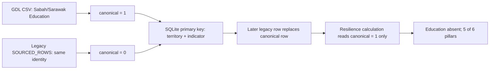
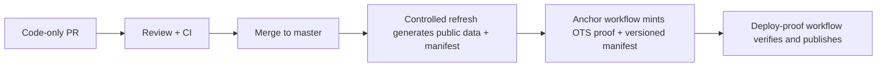

# DevOps & Data Remediation Plan — 2026-08-17

**Status:** implementation-ready investigation and repair plan  
**Scope:** BT-11a, BT-11b, BT-28 and BT-29  
**Primary lens:** ABCDE **D** (data integrity and provenance) and **E** (honest, auditable disclosure). The affected True Wealth Hexagon pillar is **Education**.

## 1. Objective and non-negotiable rules

Restore the missing Education pillar for Sabah and Sarawak, ensure that a future pillar loss blocks publication, run the full JavaScript and Python test suites in CI, and document the release/anchoring sequence for public data.

The repair must follow these rules:

- Do not invent, impute, or hide a score merely to restore a six-pillar display.
- Retain the verified Global Data Lab (GDL) Education observations already present in the CSV. Remove only the stale duplicate records that override them.
- Treat an OpenTimestamps/Bitcoin anchor as proof of the published bytes and release timing, **not** proof that a source value is substantively true.
- Keep the data-correction pull request code-only. Regenerated `public/data` artifacts, manifest, provenance, and `.ots` files must be made by the controlled post-merge refresh/anchor process.

## 2. Verified baseline

As checked on 2026-08-17:

| Territory | Published Index | Published Strict | Scored pillars | Missing pillar |
|---|---:|---:|---:|---|
| Sabah | 72.1 | 66.1 | 5 / 6 | Education |
| Sarawak | 79.3 | 77.7 | 5 / 6 | Education |
| Brunei | 78.0 | 60.9 | 6 / 6 | — |
| Kalimantan | 67.7 | 65.8 | 6 / 6 | — |

The production artifact is therefore internally consistent with the defect; it is not merely a stale browser or frontend rendering issue. The public UI is displaying what `public/data/resilience.json` says.

The repository's `origin/master` was one proof-only commit ahead of the local checkout at investigation time. That newer commit updates anchoring artifacts only; it does not contain this data-model, validation, or CI repair.

## 3. Root cause: BT-11a — Education canonical-flag collision

### What happens today

Two sources provide the same snapshot identity for each of Sabah and Sarawak:

1. `borneo_tracker_poc.csv` contains the current GDL value for `Mean years schooling (RLS)`.
2. `data_model.py` also appends a legacy hard-coded `SOURCED_ROWS` entry with the same territory and indicator.

The pipeline order in `data_model.py` is raw CSV, manual rows, aggregate rows, internet rows, then `SOURCED_ROWS`, followed by canonical assignment. The first CSV row wins the canonical flag for an equal-ranked concept. However, the database table in `load_db.py` has a primary key of `(territory, indicator)` and writes with `INSERT OR REPLACE`. The later legacy row replaces the canonical CSV row in the database but carries `canonical = 0`.

`compute_resilience.py` deliberately reads only `canonical = 1`. Its behaviour is correct for a clean dataset, but after the replacement it cannot see an Education row for either territory.



### Evidence

- The stale records are in `data_model.py` (`SOURCED_ROWS`, approximately lines 42–49): Sabah and Sarawak, `Mean years schooling (RLS)`, value `8.7`.
- The same two indicators are in `borneo_tracker_poc.csv` (approximately rows 244–245) with the GDL source attribution.
- `assign_canonical()` in `data_model.py` groups by territory and dashboard concept.
- `load_db.py` defines `PRIMARY KEY (territory, indicator)` and uses `INSERT OR REPLACE`.
- `compute_resilience.py` loads rows using `WHERE canonical = 1`.
- `public/data/indicators.json` currently contains those Sabah/Sarawak records as non-canonical and the public resilience model omits Education.

The fault first appears in the scheduled-refresh commit `506aeefe`; the legacy source row itself predates that refresh. This is a data-pipeline identity collision, not an Education scoring-formula failure.

## 4. Repair work package A — BT-11a

### Where to change

| Location | Required change |
|---|---|
| `data_model.py` | Delete the two obsolete Sabah and Sarawak `Mean years schooling (RLS)` entries from `SOURCED_ROWS`. Do not delete the GDL CSV rows. |
| `data_model.py` | Before `assign_canonical()`, add a deterministic snapshot-identity safeguard for `(territory, indicator)` duplicates after all row builders have run. |
| `load_db.py` and/or validation layer | Assert the database cannot end with a non-canonical row replacing the selected canonical snapshot. |
| `tests/` | Add a regression test which exercises the actual in-memory build/load/compute path for Sabah and Sarawak Education. |

### How to change it

1. Make the GDL CSV observation the sole current snapshot for the two Education indicators by removing only the two stale hard-coded duplicates.
2. Add one generic duplicate policy, rather than a second one-off exception:
   - group final candidate rows by `(territory, indicator)` before they are persisted;
   - select the deterministic snapshot winner using the documented canonical sort rule (newest/most-preferred source); retain stable source order as the final tie-breaker;
   - keep historical observations in the history dataset, not by allowing the snapshot table to contain ambiguous duplicate identities.
3. Fail fast if persistence would replace a selected canonical row with a non-canonical row. This protects future manual, API, or CSV additions from recreating the same class of fault.
4. Regenerate the SQLite database from the full pipeline when verifying locally. Do not rely on old ignored local databases: they can contain pre-defect rows and falsely show six pillars.

### Correctness check

The repair is correct because it preserves the verified source value and restores consistency between three concepts that must agree:

`selected source row` → `database snapshot row` → `canonical resilience input`.

It does **not** change Education normalisation: `8.7` years remains a score of `45.0` against the existing best/worst bounds of `12` and `6` years.

The in-memory pipeline replay gives the following expected corrected output:

| Territory | Expected Index | Expected Strict | Pillars | Expected weakest link |
|---|---:|---:|---:|---|
| Sabah | 67.6 | 62.0 | 6 / 6 | Food |
| Sarawak | 73.6 | 71.0 | 6 / 6 | Education |
| Brunei | 78.0 | 60.9 | 6 / 6 | Food |
| Kalimantan | 67.7 | 65.8 | 6 / 6 | Education |
| All-Borneo | 71.7 | 69.3 | 6 / 6 | — |

The previously published All-Borneo index/strict values, `74.3 / 71.7`, are artificially high because they average only five pillars for Sabah and Sarawak. The correction is expected to lower them to `71.7 / 69.3`; this is an accuracy correction, not a deterioration in real-world conditions.

### Acceptance tests

- Sabah and Sarawak each have exactly one persisted `Mean years schooling (RLS)` snapshot row.
- Each of those rows is canonical and sourced to GDL.
- `set(scoredPillars)` for every territory is all six True Wealth Hexagon pillars after the repair.
- The expected values above are asserted with an agreed numeric tolerance.
- The two old `SOURCED_ROWS` records cannot be reintroduced without a duplicate-identity test failing.

## 5. Repair work package B — BT-11b, pillar-loss gate and symmetric shift detection

### Gaps in the current controls

`validate_data.py` validates syntax, territory coverage and a broad aggregate scored-indicator threshold. It does not compare the six resilience pillars with the prior published version. During this incident the count fell from 25 to 23 and still passed the 90% floor (22).

`detect_resilience_shifts.py` loops through the current pillar-score keys only. If a pillar disappears, there is no current key to inspect, so no loss is reported. Replaying the known bad change produces warnings about index/RAG/weakest-link shifts but does not state that Sabah and Sarawak lost Education.

The existing resilience-watch workflow is informational and runs after refresh. It cannot block a bad artifact from being committed.

### Where to change

| Location | Required change |
|---|---|
| `validate_data.py` | Add an enforceable per-territory pillar comparison against the prior released artifact. |
| `validate_data.py` | Add internal resilience-model set-consistency checks. |
| `detect_resilience_shifts.py` | Report both lost and added pillars using symmetric set differences. |
| `validate_data.py` / `detect_resilience_shifts.py` | Accept an explicit baseline Git ref or file path. |
| `.github/workflows/data-refresh.yml` (or its current equivalent) | Pass the previous published commit as baseline before committing new data. |
| CI workflow | Test the gate with fixtures, independently of Git history. |

### How to change it

1. For every territory in both the baseline and candidate models calculate:

   ```text
   lost_pillars  = baseline.scoredPillars - candidate.scoredPillars
   added_pillars = candidate.scoredPillars - baseline.scoredPillars
   ```

   Any non-empty `lost_pillars` must fail `validate_data.py` with the territory and pillars named. Added pillars are reported but do not fail by themselves.

2. Independently assert, for each territory:

   ```text
   set(scoredPillars) == set(pillarScores.keys()) == set(detail.keys())
   set(scoredPillars) ∩ set(unscoredPillars) == empty
   set(scoredPillars) ∪ set(unscoredPillars) == set(PILLARS)
   ```

3. Change the shift detector to examine the union of baseline and candidate pillars. It must say both what disappeared and what appeared. It remains a human-review signal; the validator is the blocking control.
4. Do not use an implicit `HEAD` comparison in every context. In a refresh run, `HEAD` is the prior published artifact and is appropriate. In a pull request, pass the PR base SHA (or merge base) explicitly; otherwise the comparison may accidentally compare the candidate file to itself.
5. Add small checked-in JSON fixtures representing the known `b66a900b → 506aeefe` loss. Tests must prove the validator fails before the repair and that a six-pillar candidate passes. Fixtures avoid a fragile dependency on a shallow Git checkout or historical blobs.

### Correctness check

This gate catches the actual failure mode: it evaluates semantic pillar coverage per territory, rather than relying on a global row-count proxy. It still permits legitimate new coverage, and it makes a legitimate planned removal an explicit, reviewed exception rather than a silent publication.

## 6. Repair work package C — BT-29, complete CI for JavaScript and Python

### Verified current gap

`package.json` defines `npm test` as `vitest run`, but no GitHub workflow runs it. The deployment PR-validation workflow currently runs lint/build and only three Python contract modules; it does not cover application source changes generally and its path filters omit `src/`, data-model scripts, and most tests.

The audit found 39 Vitest files (733 tests) and 17 Python test modules/scripts. Sixteen Python modules run through `unittest`; `test_anchoring.py` is a separate golden test.

At the audit point, the complete JS suite had two deterministic-but-date-fragile failures (731/733 passed):

- `supabase/functions/ai-chat/factObjectBuilder.test.js`
- `supabase/functions/ai-chat/structuredAnswerBuilder.test.js`

Both hard-code district metadata freshness as `2026-08-09`, while the committed district data is generated on `2026-08-17`. This is a test expectation defect caused by live data refresh, not a product regression.

### Where to change

| Location | Required change |
|---|---|
| `supabase/functions/ai-chat/factObjectBuilder.test.js` | Derive expected district freshness from the loaded district dataset/fixture, not a calendar literal. |
| `supabase/functions/ai-chat/structuredAnswerBuilder.test.js` | Make the same data-driven expectation change. |
| `tests/__init__.py` or test runner command | Make the test package discoverable, or use a documented explicit runner list. |
| `test_anchoring.py` | Keep as an explicit CI command if it remains outside the `tests` package. |
| `.github/workflows/ci.yml` (new) | Add a general PR and master CI workflow for all JS and Python suites. |
| `.github/workflows/deployment-pr-validation.yml` | Retain specialised release-contract checks; do not treat it as the substitute for general CI. |

### How to change it

Create a general CI workflow triggered on every pull request to `master` and on pushes to `master`, with no narrow application-source path exclusion. Use the repository's supported Node 22 version and Python 3.12, then run:

```powershell
npm ci
npm run lint
npm test
python -m unittest discover -s tests -t .
python test_anchoring.py
```

If discovery cannot be made importable without undesirable restructuring, document and run the full explicit list of `tests/test_*.py` modules instead. The key requirement is coverage of all 17 current Python test units, not merely a command that exits zero.

The two AI-chat test assertions must read `generatedAt` from the dataset loaded in the test, or use a fixed test fixture. Production data dates must never be copied into expected strings.

### Correctness check

The proposed CI runs the commands developers rely on locally and covers code paths the existing release workflow does not. Its date-stable test expectation checks the intended message structure and current metadata without failing merely because the scheduled data refresh succeeded.

## 7. Repair work package D — BT-28, public-data release and anchoring runbook

### Current release contract

The pipeline is intentionally multi-commit:



`run_pipeline.py` creates the data artifacts and `emit_manifest.py` hashes the six declared files. The refresh workflow commits changed data, manifest and provenance, then dispatches `anchor-manifest`. The anchor workflow creates the `.ots` proof and versioned manifest/proof, then dispatches deployment. The deploy workflow verifies the exact proof commit before publishing.

This ordering is required. A commit that first changes data cannot already contain a final timestamp proof of the manifest it just generated. Trying to require a completed proof in the same data PR would make the contract impossible.

### Required runbook document

Add a concise operator-facing release document (for example `docs/DATA_RELEASE_AND_ANCHORING_RUNBOOK.md`) with this checklist:

1. **Code pull request:** contains source, validation, tests and documentation only. It must not manually modify regenerated `public/data` artifacts or anchors.
2. **Before merge:** general CI, release-contract checks, and review must be green. Verify that the intended data source/licence and disclosure fields are present.
3. **Refresh after merge:** run scheduled/manual data refresh on `master`. Require validation, including the new pillar-loss gate, before the workflow can commit artifacts.
4. **Manifest:** verify the manifest scope is exactly the six contract files and hashes match the newly generated artifacts.
5. **Anchor:** allow the anchor workflow to mint the OpenTimestamps proof, commit `anchors.jsonl`, latest proof and versioned manifest/proof under `public/data/versions/<manifest-sha>/`.
6. **Deploy:** deploy only the proof commit. Verify manifest/proof binding before upload and record the run URL and manifest SHA in the release note.
7. **Post-deploy:** fetch the live public artifacts, confirm all territories have the expected coverage and keep a short client-facing correction notice.

The observed 2026-08-17 actions confirm this sequence is operational: refresh, then anchor, then deployment completed automatically. The local verifier reporting `PENDING` when no Bitcoin Core backend is configured is expected: binding and proof format can pass before local blockchain-inclusion verification is available.

### Correctness check

The runbook separates three claims that must not be conflated:

| Claim | Control |
|---|---|
| The calculation/data model is valid | Source review, validator, full CI and data-quality gates |
| The published files are exactly the reviewed/generated files | Manifest hashing and deploy proof-binding verification |
| The release existed no later than a timestamp/Bitcoin attestation | OpenTimestamps anchor verification |

## 8. Implementation order

1. Fix the two date-fragile JS test expectations and establish general CI (BT-29). This gives immediate signal for the rest of the change.
2. Implement the BT-11a source cleanup, generic snapshot duplicate protection, and regression tests.
3. Implement BT-11b hard validation gate, symmetric detector, explicit baseline handling, and fixture tests.
4. Add the BT-28 release/anchoring runbook and make the refresh workflow invoke the gate before any artifact commit.
5. Open one code-only PR containing these changes. Do not commit regenerated public data in it.
6. After merge, run the controlled refresh → anchor → deploy sequence; publish the corrected artifacts and disclosure.

## 9. Verification matrix

| Stage | Evidence required |
|---|---|
| Local/unit | All Vitest tests pass; all Python tests including `test_anchoring.py` pass. |
| Regression | The historical 6-to-5-pillar fixture fails with explicit Sabah/Sarawak Education loss. |
| Data build | Fresh database contains canonical GDL Education rows and the expected six-pillar resilience outputs. |
| CI | New general CI is green for the PR; specialised release-contract checks remain green. |
| Refresh | Validator runs against the prior release before any generated files are committed. |
| Anchor | Manifest contains exactly the declared data scope; proof binds to its manifest SHA. |
| Production | Live artifacts show all territories at 6/6 and values match the signed-off corrected output. |

## 10. Definition of done

This remediation is complete only when all of the following are true:

- The stale collision is removed and cannot silently recur.
- Sabah and Sarawak Education are genuine canonical inputs, not frontend defaults.
- A future per-territory pillar loss fails the publishing pipeline before release.
- The shift report names both lost and added pillars.
- JavaScript and Python suites are mandatory CI checks and are not date-fragile.
- The team has a written, followed release/anchor/deploy procedure.
- The refreshed, anchored and deployed public artifacts show the corrected six-pillar scores and the correction is communicated honestly to users.

## 11. Explicit non-actions and risks

- Do not "fix" the issue in the frontend; that would misrepresent incomplete data.
- Do not change the Education score bounds to force a preferred outcome.
- Do not manually edit a manifest, anchor or `.ots` file after it is generated.
- Do not make the anchor a substitute for source validation; it proves publication integrity, not source truth.
- Daily live-source changes may legitimately create new data versions. The release policy should preserve source `last_updated` fields and distinguish normal freshness changes from metric changes in release notes.

