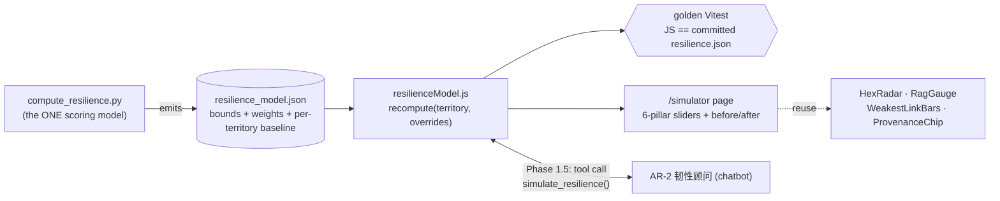

# Impact Simulator — Build & Integration Spec

> **Handoff doc.** The **aichatbot workstream owns this build** (it also owns the chatbot, and
> the two connect — one owner avoids a cross-chat seam).
> **Status:** spec ready, not started. **Base off `master`** (`01602d0` — already has Phase 0 +
> the Food per-capita fix). **Date:** 2026-08-01.

---

## 0. What it is (and is NOT)

The Impact Simulator is a **deterministic "What-If" tool**: pick a territory, drag an indicator
(e.g. Brunei food self-sufficiency 8 → 40), and the **Resilience Index + True-Wealth Hexagon
recompute live**, showing **before → after**.

- It is **NOT** the chatbot. The chatbot (AR-2 韧性顾问) is conversational Q&A; the Simulator is
  sliders + deterministic math.
- **v1 = deterministic only, NO LLM.** The chatbot *calling* the engine is **Phase 1.5** (§5).

**Why it matters (ABCDE):** it is the **A** differentiator — turns the dashboard from
*descriptive* ("here is the data") into *prescriptive* ("what moves the needle"). Payer =
governments / planners (development planning & approvals). It literally demonstrates the book's
thesis (e.g. *Brunei money-rich / food-fragile* → simulate raising food self-sufficiency).
**E-safe** because it is deterministic and always labelled *"illustrative, not a forecast."*

---

## 1. Architecture (the picture)



Text version: `compute_resilience.py` **emits the model** → JS **mirrors it** (`recompute`) →
a **golden test** proves JS never drifts from Python → the **/simulator UI** drives it → later
the **chatbot calls the same engine** instead of guessing.

---

## 2. The engine — SINGLE SOURCE OF TRUTH (the E-critical part)

**The failure to prevent:** the Simulator computing *different* numbers than the real index —
that would make the flagship feature **lie**, killing the E-moat. So:

**Rule: ONE model, emitted once, mirrored, and guarded by a test.**

1. **`compute_resilience.py` emits `public/data/resilience_model.json`** containing everything the
   client needs to reproduce a score:
   - `pillars`: `["Food","Energy","Education","Shelter","Healthcare","Entertainment"]`
   - `bounds`: per-indicator `{unit, best, worst}` (the existing `BOUNDS` table)
   - `indicatorToPillar`: which indicator feeds which pillar
   - `index`: `{ method: "arithmetic + geometric(strict)", ragBands: {green:70, amber:40} }`
     *(confirm the exact bands/formula in `compute_resilience.py`)*
   - `baseline`: per territory `{ inputs:{indicator:value}, pillarScores:{...}, index, indexStrict }`
2. **`src/utils/resilienceModel.js`** implements `recompute()` by **applying those params** — it
   must NOT hard-code its own bounds/weights (that would be a second source of truth = drift).
3. **Golden Vitest** (`resilienceModel.test.js`): for all 4 territories,
   `recompute(territory, {})` must reproduce the **committed `resilience.json`** (`index`,
   `indexStrict`, every `pillarScore`) within rounding. **Drift → red.** This is the anti-lie gate.
   - The test reads **both committed files from the same commit** (`resilience_model.json` baseline
     and `resilience.json`), so it stays green across daily data refreshes (both regenerate together).

### `recompute` contract (the seam)
```
recompute(territory, overrides = { indicatorName: newValue })
  -> { pillarScores: {pillar: 0..100}, index, indexStrict, rag, weakestPillar, deltas }
```
- start from `baseline.inputs`, apply `overrides`
- normalise each indicator via `bounds` → 0..100 (clamp)
- aggregate to pillars (**equal weight**, matching `compute_resilience.py`)
- `index` = arithmetic mean; `indexStrict` = geometric mean; `rag` from bands; surface `weakestPillar`

---

## 3. The `/simulator` UI

- New route **`/simulator`** in `src/App.jsx`, under `<Layout>`.
- **Territory selector** (Sabah / Sarawak / Brunei / Kalimantan).
- **Sliders for all six pillars'** key inputs (**D7 = the long-term full version**, not just the
  weakest pillar). Each slider **clamped to a plausible range** (you can't set 500% self-sufficiency).
- **Live before → after**: `HexRadar` (both states overlaid), `RagGauge` (index before→after),
  `WeakestLinkBars`, the `index`/`indexStrict` numbers, weakest-pillar before/after, RAG-band change.
- **"Reset to baseline"** button.
- **Every panel labelled** *"Illustrative — deterministic scenario, not a forecast."*
- **Reuse** existing components (`HexRadar`, `RagGauge`, `WeakestLinkBars`, `ProvenanceChip`) — do
  not fork them.

---

## 4. Chatbot integration — Phase 1.5 (AFTER the engine + UI work)

The AR-2 韧性顾问 gets a **deterministic tool** that calls the SAME engine:
```
tool simulate_resilience(territory, changes: { indicator: value })
  -> { before:{index,pillarScores,weakest}, after:{...}, deltas:{...} }
```
- Implemented by calling `recompute()` (or a shared TS port inside the ai-chat edge function).
- The chatbot answers *"what if Brunei doubled paddy?"* by **calling the tool and narrating the
  deterministic result** — never by guessing. Every such answer is grounded and reproducible.
- Because this workstream owns **both** the chatbot and the engine, this is a **same-branch**
  integration with no cross-chat seam.

---

## 5. Rules / constraints (do not violate)

1. **Deterministic core, no LLM in v1.** Leave the `simulate_resilience` tool seam for Phase 1.5.
2. **One source of truth** for the scoring model (Python emits, JS mirrors, golden test guards).
3. **All six pillars** (D7 = long-term).
4. **Always "illustrative"** — never present as a forecast or a causal claim.
5. **Don't over-build** — no scenario persistence, no historical playback, no auth in v1.

---

## 6. Build checklist (in order)

1. [ ] `compute_resilience.py` → emit `resilience_model.json` (bounds, maps, weights, formula,
       per-territory baseline inputs + outputs). Wire into `run_pipeline.py`; add to
       `emit_manifest.py` `TRACKED_FILES` so it is hashed/verified like the others.
2. [ ] `src/utils/resilienceModel.js` → `recompute(territory, overrides)` mirroring the Python.
3. [ ] `src/utils/resilienceModel.test.js` → golden test: JS reproduces `resilience.json` for all 4.
4. [ ] `/simulator` route + `ImpactSimulator.jsx`: 6-pillar sliders + before/after (reused components)
       + "illustrative" labels + reset + input clamping.
5. [ ] Tests + `npm run lint` + `npm run build` green.
6. [ ] **(Phase 1.5)** chatbot `simulate_resilience` tool calling `recompute`.
7. [ ] Merge to master (one branch merges at a time; rebase others after).

---

## 7. Coordination / conflict-avoidance

- **Base off current `master`** (`01602d0` = Phase 0 + Food fix). The aichatbot branch is behind —
  `git merge origin/master` first (or branch `feature/impact-simulator` off master), so you build on
  the corrected Food data and the versioned pipeline.
- **Files this touches:** `compute_resilience.py`, `run_pipeline.py`, `emit_manifest.py`, new
  `public/data/resilience_model.json`, new `src/utils/resilienceModel.js` (+ test), new
  `src/pages/.../ImpactSimulator.jsx`, `src/App.jsx` (add route).
- ⚠️ **`compute_resilience.py` — only this build should edit it** right now. Don't let another chat
  touch it concurrently (it is the scoring model).
- ⚠️ **`App.jsx`** — additive route only; expect a small merge with other UI branches.
- The **daily refresh** regenerates `resilience.json` (and, once wired, `resilience_model.json`)
  together — the golden test stays valid because both come from the same run.

---

## 8. Reference facts (verified in the repo, 2026-08-01)

- **Scoring model:** `compute_resilience.py` — `BOUNDS` per indicator `{unit, best, worst}`;
  `PILLARS = [Food, Energy, Education, Shelter, Healthcare, Entertainment]`; linear normalisation
  vs bounds; arithmetic index + **geometric ("strict") index** that collapses toward zero if any
  pillar is near zero ("no food = no resilience"); RAG bands ~70 / ~40; weakest pillar surfaced.
- **`resilience.json` shape:** `territories[name].{ index, indexStrict, rag, weakestPillar,
  pillarScores{6 pillars}, detail{} }`. Current baseline: Sabah 63.7 (weakest **Food** 28.7),
  Sarawak 72.5, Brunei 79.0 (strict **61.8**, weakest **Food** 8.1), Kalimantan 68.5.
- **Food per-capita** = latest paddy production ÷ 2024 population (see the Food fix +
  `DATA_INTAKE_ROADMAP.md`); the simulator's Food slider drives this per-capita input — label its year.
- **Frontend:** React 19 + Vite; data via `src/data/useIndicators.js` hooks; reusable viz
  components in `src/components/` (`HexRadar`, `RagGauge`, `WeakestLinkBars`, `ProvenanceChip`).
- **Source of design intent:** `docs/LOOP_ENGINEERING_PLAN.md` §Phase 1;
  `docs/ABCDE_HEXAGON_REFRAME_PLAN.md` (Impact Simulator = Phase 4 there);
  `.claude/skills/borneo-abcde-framework` (why it's the "A" hero).
