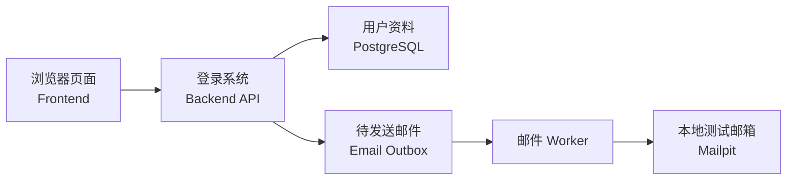

# Borneo Tracker 本地 Login 启动指南

这份指南写给第一次接触本项目的人。按照下面的顺序操作，就可以在 Windows 的 localhost 环境启动完整的 Login 系统。

> 当前是非 Production 开发环境。网站、Backend、数据库和邮件都只在本机运行，不会发布到公网。

## 1. 先理解 Login 系统有哪些部分

完整的 Login 功能不是只有一个网页，而是由以下部分一起工作：



- **Frontend**：显示注册、登录、忘记密码和个人资料页面。
- **Backend API**：检查密码、建立用户、管理 Session 和处理安全规则。
- **PostgreSQL**：保存用户、Profile、Session、Token、邮件任务和 Audit Events。
- **Worker**：从数据库取出待发送邮件并发送。
- **Mailpit**：接收本地测试邮件，不会把邮件发送到真实邮箱。
- **Docker Desktop**：负责运行 PostgreSQL 和 Mailpit。

只运行 `npm run dev` 只会启动网页。完整 Login 功能还需要数据库、Backend 和 Worker。

## 2. 每次启动前需要准备什么

这台电脑已经安装过项目依赖。日常启动不需要重复运行 `npm install`。

如果是在一台全新的电脑或第一次下载项目，才需要先运行：

```powershell
cd D:\Borneo_Tracker
npm install
npm run db:generate
```

`npm install` 会安装项目需要的程序包。`npm run db:generate` 会准备 Backend 访问 PostgreSQL 所需的数据库客户端。

## 3. 第一步：打开 Docker Desktop

1. 打开 Windows 开始菜单。
2. 搜索并打开 **Docker Desktop**。
3. 等待 Docker Desktop 完全启动。
4. 确认 Docker Engine 已经运行。

Docker Desktop 本身不是数据库。它是负责运行 PostgreSQL 和 Mailpit 的工具。

如果 Docker Desktop 没有运行：

- Backend 无法读取用户资料。
- 用户无法正常注册或登录。
- Mailpit 无法接收测试邮件。

## 4. 第二步：进入项目目录

打开 PowerShell，输入：

```powershell
cd D:\Borneo_Tracker
```

成功后应该看到：

```text
PS D:\Borneo_Tracker>
```

`cd` 的意思是进入指定文件夹。后续命令必须在 `D:\Borneo_Tracker` 中运行，否则 PowerShell 可能找不到项目配置。

## 5. 第三步：启动 PostgreSQL 和 Mailpit

在 PowerShell 输入：

```powershell
docker compose up -d
```

这条命令会读取项目根目录的 `compose.yaml`，然后在后台启动：

- PostgreSQL 数据库
- Mailpit 本地邮箱

其中：

- `up` 表示启动服务。
- `-d` 表示让服务在后台持续运行。

使用下面的命令检查状态：

```powershell
docker compose ps
```

正常情况下会看到 `postgres` 和 `mailpit`，状态应该是 `Up` 或 `healthy`。

本地地址：

- PostgreSQL：`localhost:5433`
- Mailpit SMTP：`localhost:1025`
- Mailpit 网页：<http://localhost:8025>

## 6. 第四步：更新数据库结构

继续在项目目录运行：

```powershell
npm run db:deploy
```

这条命令会执行数据库 Migration，确保 PostgreSQL 具有 Login 系统需要的表格，例如：

- Users
- Profiles
- Sessions
- Email verification tokens
- Password reset tokens
- Email outbox
- Audit events

如果看到：

```text
No pending migrations to apply
```

代表数据库已经是最新结构，不需要进一步修改。这不是错误。

正常运行 `npm run db:deploy` 不会删除已有用户资料。

## 7. 第五步：启动 Backend API

在第一个 PowerShell 运行：

```powershell
npm run dev:server
```

Backend 负责：

- 注册用户
- 检查 Email 和输入资料
- 加密及验证密码
- 保存和读取数据库
- 建立 Login Session
- 处理邮箱验证 Token
- 处理忘记密码和密码重设
- 修改密码和登录邮箱
- 处理登出和全部设备登出
- 检查普通用户与管理员权限

Backend 地址：

```text
http://localhost:3001
```

健康检查地址：

<http://localhost:3001/api/health/ready>

正常时会显示：

```json
{"status":"ready"}
```

运行后不要关闭这个 PowerShell。关闭后网页可能仍然能打开，但注册和登录请求无法处理。

## 8. 第六步：启动邮件 Worker

打开第二个 PowerShell，运行：

```powershell
cd D:\Borneo_Tracker
npm run dev:worker
```

Worker 负责发送：

- 注册验证邮件
- 重新发送验证邮件
- 忘记密码邮件
- 密码修改通知
- 登录邮箱修改确认
- 邮箱修改安全通知

Backend 不会直接发送邮件。Backend 会先把邮件任务保存在 PostgreSQL 的 Email Outbox，Worker 再读取并发送给 Mailpit。

如果 Backend 正在运行但 Worker 没有运行：

- 注册可能仍然成功。
- 邮件任务会保存在数据库。
- Mailpit 暂时不会收到邮件。

运行后不要关闭 Worker 的 PowerShell。

## 9. 第七步：启动 Frontend 网站

打开第三个 PowerShell，运行：

```powershell
cd D:\Borneo_Tracker
npm run dev
```

Frontend 负责显示 UI，并把用户操作发送给 Backend。它不会直接检查密码、操作数据库或发送邮件。

成功后会显示类似：

```text
Local: http://localhost:5173/
```

打开网站：

<http://localhost:5173>

常用页面：

- Login：<http://localhost:5173/login>
- Register：<http://localhost:5173/register>
- Mailpit：<http://localhost:8025>

不要关闭 Frontend 的 PowerShell。

## 10. 为什么需要三个 PowerShell

下面三个命令都是持续运行的服务：

```powershell
npm run dev:server
npm run dev:worker
npm run dev
```

每一个命令运行后都会占用当前窗口，因此需要：

- PowerShell 1：Backend API
- PowerShell 2：Email Worker
- PowerShell 3：Frontend 网站

PostgreSQL 和 Mailpit 已经由 Docker 在后台运行，不需要额外占用 PowerShell。

## 11. 测试注册和邮箱验证

1. 打开 <http://localhost:5173/register>。
2. 填写 First name、Last name、Email 和 Password。
3. 点击 **Register**。
4. 打开 <http://localhost:8025>。
5. 在 Mailpit 打开 Borneo Tracker 验证邮件。
6. 点击邮件中的 **Continue securely**。
7. 验证成功后打开 <http://localhost:5173/login>。
8. 使用刚才注册的 Email 和 Password 登录。

Mailpit 是本地测试邮箱。邮件不会真的发送到 Gmail、Outlook 或其他真实邮箱。

注册过程实际发生的事情：

1. Frontend 把注册资料发送给 Backend。
2. Backend 检查资料并加密 Password。
3. Backend 把用户和一次性验证 Token 保存到 PostgreSQL。
4. Backend 把验证邮件任务放入 Email Outbox。
5. Worker 取出任务并发送给 Mailpit。
6. 用户点击验证链接。
7. Backend 验证 Token，并启用用户账号。

## 12. 查看 PostgreSQL 数据库

打开第四个 PowerShell，运行：

```powershell
cd D:\Borneo_Tracker
npm run db:studio --workspace server
```

Prisma Studio 通常会提供：

<http://localhost:5555>

Prisma Studio 可以查看数据库资料，但不是 Login 系统运行的必要条件。

本地数据库连接资料：

```text
Host: localhost
Port: 5433
Database: borneo_tracker_app
Username: borneo_app
Password: local_borneo_password
```

数据库实际保存在 Docker Volume 中，不是项目目录里的普通文件。

## 13. 每天启动时的简化步骤

### PowerShell 1

```powershell
cd D:\Borneo_Tracker
docker compose up -d
npm run db:deploy
npm run dev:server
```

### PowerShell 2

```powershell
cd D:\Borneo_Tracker
npm run dev:worker
```

### PowerShell 3

```powershell
cd D:\Borneo_Tracker
npm run dev
```

最后打开：

<http://localhost:5173>

## 14. 正确停止系统

在 Backend、Worker 和 Frontend 的三个 PowerShell 窗口中分别按：

```text
Ctrl + C
```

然后在项目目录运行：

```powershell
docker compose stop
```

这会停止 PostgreSQL 和 Mailpit，但不会删除数据库资料。

不要随便运行：

```powershell
docker compose down -v
```

`-v` 会删除 PostgreSQL 使用的 Docker Volume，也就是删除本地数据库资料。

## 15. 常见问题

### `docker compose up -d` 失败

确认 Docker Desktop 已经打开，并且 Docker Engine 完全启动。

### 网站打不开

确认 `npm run dev` 的 PowerShell 仍然运行，并打开 <http://localhost:5173>。

### Login 显示 Backend unavailable

确认 `npm run dev:server` 仍然运行，并检查 <http://localhost:3001/api/health/ready>。

### 注册后收不到邮件

确认：

- `npm run dev:worker` 正在运行。
- Mailpit 容器正在运行。
- 已经刷新 <http://localhost:8025>。

### Frontend 自动使用 `5174`

这通常代表另一个 Frontend 已经占用 `5173`。不要继续使用 `5174`，因为当前 Login 本地安全配置使用 `5173`。

找到之前运行 `npm run dev` 的 PowerShell，按 `Ctrl + C`，然后重新运行：

```powershell
npm run dev
```

### 数据库连接失败

运行：

```powershell
docker compose ps
```

确认 PostgreSQL 状态是 `Up` 或 `healthy`。如果没有运行，重新执行：

```powershell
docker compose up -d
```

## 16. 最重要的结论

代码已经写好，并不代表它正在运行。完整 Login 功能必须同时启动：

```text
PostgreSQL + Mailpit + Backend API + Email Worker + Frontend
```

对应命令是：

```powershell
docker compose up -d
npm run db:deploy
npm run dev:server
npm run dev:worker
npm run dev
```

可以把代码理解为机器的设计图，而启动命令是打开机器的电源。
