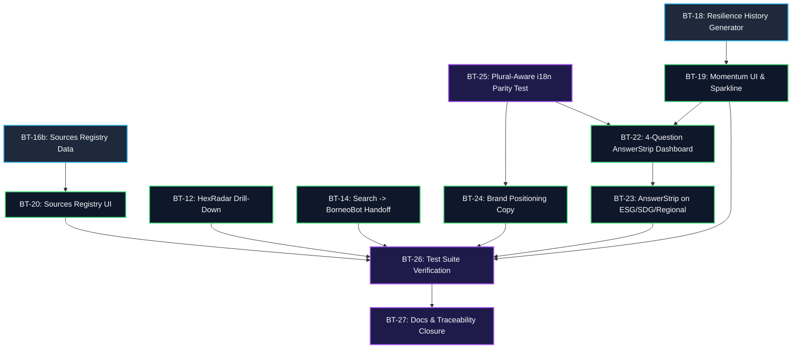

# Wave 3 完整执行与修复方案（Execution & Fixing Plan）

**编制日期**：2026-08-24  
**项目代号**：Borneo Tracker / WeScreen (Wave 3)  
**目标定位**：Momentum（历史动量）、Drill-down（下钻穿透）、Decision Framing（决策框架）、Trust Registry（数据源透明度）与 i18n Parity 质量防护。

---

## 目录
1. [Wave 3 全景任务复杂度与深度分级](#1-wave-3-全景任务复杂度与深度分级)
2. [依赖拓扑关系与关键路径（Dependency Graph）](#2-依赖拓扑关系与关键路径dependency-graph)
3. [潜在未知因素与关键 Edge Cases 审计（Hidden Risks）](#3-潜在未知因素与关键-edge-cases-审计hidden-risks)
4. [四阶段分步修复方案（Step-by-Step Fixing Plan）](#4-四阶段分步修复方案step-by-step-fixing-plan)
5. [工单修复细则与代码契约（Ticket Specifications）](#5-工单修复细则与代码契约ticket-specifications)
6. [质量保障与验收标准（QA & Acceptance Criteria）](#6-质量保障与验收标准qa--acceptance-criteria)

---

## 1. Wave 3 全景任务复杂度与深度分级

我们将 12 张工单按**系统影响面（Blast Radius）**、**算法复杂度**与**开发深度**划分为 4 个层级：

| 复杂度等级 | 涉及工单 | 技术难点与核心影响 |
|---|---|---|
| **L4 - 架构级 / 极高风险** | **BT-18** (Resilience History) | 涉及 Git 45 次历史版本回溯、时间序列口径对齐、历史 Bug 断点标注；决定数据是否进入比特币 OTS 证明树（Option A vs Option B），直接影响全局哈希验证。 |
| **L3 - 业务核心 / 中高复杂度** | **BT-16b** (Sources Registry)<br>**BT-19** (Momentum UI)<br>**BT-22** (AnswerStrip Dashboard)<br>**BT-12** (HexRadar Drilldown) | 涉及结构化数据源体系建立、环比差值与最大变动柱计算、四问决策流逻辑组装、SVG 雷达顶点可交互与指标下钻 Modal。 |
| **L2 - 页面扩展 / 中等复杂度** | **BT-20** (Sources Registry UI)<br>**BT-14** (Search $\to$ BorneoBot)<br>**BT-23** (AnswerStrip ESG/SDG/Regional)<br>**BT-25** (i18n Plural Parity Test)<br>**BT-26** (Wave 3 Test Suites) | 涉及密码学账本与数据源目录的分离展示、搜索无结果态与 AI 对话框联动及配额防护、多页面决策条适配、基于 `Intl.PluralRules` 的英马双语法则测试。 |
| **L1 - 内容与收尾 / 低复杂度** | **BT-24** (Positioning Copy)<br>**BT-27** (Docs & Traceability) | 品牌标语更新（避免污染 20px 定高 Footer）、客户反馈跟踪矩阵（§1.1 至 §5）归档与进度文档更新。 |

---

## 2. 依赖拓扑关系与关键路径（Dependency Graph）

### 2.1 依赖关系图



### 2.2 必须优先完成什么（Critical Path）

1. **第一必须完成：`BT-25` (i18n Parity 规则校验)**
   - **原因**：Wave 3 会为 AnswerStrip、Momentum、Sources、Slogan 等引入大量新文案。若无语法感知的自动化测试先做防护，后续任何文案改动都可能因为缺少对应翻译或复数规则误判而破坏 CI。
2. **数据轨（Data Track）：`BT-16b` $\to$ `BT-20`**
   - 必须先写 `sources_registry.py` 生成 `sources.json`，前端 `BT-20` 才能渲染数据源透明度视图。
3. **动量轨（History Track）：`BT-18` $\to$ `BT-19` $\to$ `BT-22` $\to$ `BT-23`**
   - 必须先通过 `build_resilience_history.py` 产出 `resilience_history.json`，`BT-19` 才能计算得分变化；`BT-22` 决策条依赖动量与 Headline，`BT-23` 则是 `BT-22` 在其他页面的泛化复用。
4. **独立并行前端（Independent UX）：`BT-12`、`BT-14`、`BT-24`**
   - 这三张卡片依赖的数据（`resilience.json:detail`、AI 聊天框、基础路由）在主干上已齐备，可随时与数据轨并行开发。

---

## 3. 潜在未知因素与关键 Edge Cases 审计（Hidden Risks）

在落地实施前，必须严格规避以下 8 个深层陷阱：

### 3.1 陷阱一：数据发布顺序违规（BT-28 规则）
- **风险**：如果在功能 PR 中直接放入本地重新生成的 `public/data/` 文件，会导致 PR 校验流水线因找不到匹配的比特币 OTS 证明而直接挂掉。
- **规避方案**：代码 PR 仅包含 Python 脚本、前端代码和测试代码；合并到主干后，由 GitHub Actions 触发 `refresh-data.yml` $\to$ `anchor.yml` 自动生成数据与上链证明。

### 3.2 陷阱二：比特币哈希 Manifest 膨胀与客户端报错（BT-18 Option A vs Option B）
- **风险**：如果将 `resilience_history.json` 加入 `manifest_contract.py`（从 6 个文件变为 7 个），所有旧版浏览器缓存会因 `useIntegrity.js` 中的 6 文件校验失败而直接报 `INVALID`（篡改警告）。
- **规避方案**：**采用 Option A（Unhashed Auxiliary File）**。将历史数据作为辅助数据输出，不修改 6 核心文件哈希树，确保客户端验证 100% 稳定。

### 3.3 陷阱三：历史 Bug 误当成正面进步（BT-18 历史回溯）
- **风险**：沙巴分数曾在 2026-08-02 从 63.7 突增至 72.1，这是因为教育数据丢失 Bug（BT-11a）导致的伪高分。
- **规避方案**：历史数据必须附带 `methodologyTag`，并将修复前的数据标记为 `isMethodologyBreak: true`，严禁在前端渲染为“沙巴韧性大幅提升”。

### 3.4 陷阱四：平态日常刷新显示 `+0.0` 假死（BT-19 Momentum）
- **风险**：上游宏观数据多为年更或季更，日常自动刷新时 $\Delta$ 通常为 0。如果直接显示 `+0.0` 会让用户误以为系统异常。
- **规避方案**：当 $\Delta = 0$ 时，渲染平态说明 *“No change since <上次变动日期>”*；仅在存在真实有效变化时渲染升降箭头。

### 3.5 陷阱五：雷达图未评分柱虚构 0 分（BT-12 Drill-down）
- **风险**：若某地区某柱无官方对等数据（Unscored），若下钻弹窗显示 0 分会严重误导用户。
- **规避方案**：严格遵守 ABCDE Ethics 原则，未评分柱点击后显示诚实的“暂无对等数据”状态卡，并指引至数据补全路线图。

### 3.6 陷阱六：搜索路由触发 429 导致 UI 白屏（BT-14 BorneoBot）
- **风险**：搜索导向 AI 会增加 Supabase Edge Function 调用频次，触发 `AI_CHAT_QUOTA_EXHAUSTED` (429)。
- **规避方案**：前端对接时必须做好错误捕获与降级处理，当触发配额限制时展示模板化答复或静态六柱指引。

### 3.7 陷阱七：马来文 i18n 复数规则特性（BT-25）
- **风险**：英文有 `_one` 和 `_other` 复数后缀，而马来文（`Intl.PluralRules('ms')`）仅有 `other` 单一形式。若写纯键名比对测试会引发大量假阳性报错。
- **规避方案**：测试在比对前使用正则去除 `_(one|other|zero|few|many)` 后缀，比对规范化根键。

### 3.8 陷阱八：Footer 定高布局溢出（BT-24）
- **风险**：`footer.jsx` 是 20px 的定高横条，如果强行把多行 Slogan 塞入 Footer 会导致页面底部排版崩塌。
- **规避方案**：Slogan 仅放置在 `AboutPage.jsx` Hero 区域与 `AuthLayout.jsx` 登录框上方。

---

## 4. 四阶段分步修复方案（Step-by-Step Fixing Plan）

### 阶段一：防护网与独立交互（Day 1）
- [x] **Step 1.1 (BT-25)**: 编写 `src/test/i18nParity.test.js`，建立英马双语复数感知校验机制。
- [x] **Step 1.2 (BT-24)**: 在 `en.json` 与 `ms.json` 中配置 Slogan，更新 `AboutPage.jsx` 与 `AuthLayout.jsx`。
- [x] **Step 1.3 (BT-14)**: 改造 `OverviewDashboard.jsx` 搜索框无结果态，打通 `AIChatDialog.jsx` 预填提问与 429 防护。
- [x] **Step 1.4 (BT-12)**: 升级 `HexRadar.jsx` 增加点击与键盘无障碍事件，开发 `PillarDrilldownModal.jsx` 指标穿透弹窗。

### 阶段二：数据底座与信任注册表（Day 2）
- [x] **Step 2.1 (BT-16b)**: 编写 `sources_registry.py`，规范 14~18 个权威发布源，由 `export_json.py` 导出 `public/data/sources.json`。
- [x] **Step 2.2 (BT-20)**: 在 `DataVerification.jsx` 增加数据源透明度 Tab/Section，开发 `SourceRegistryTable.jsx`，与密码学账本分立展示。
- [x] **Step 2.3 (BT-18)**: 编写 `build_resilience_history.py`，生成标记了版本断点的 `public/data/resilience_history.json`（Option A 模式）。

### 阶段三：动量与决策层全量贯通（Day 3）
- [x] **Step 3.1 (BT-19)**: 编写 `src/utils/momentum.js` 与 `MomentumBadge.jsx`（含轻量级 SVG Sparkline），接入看板分数卡。
- [x] **Step 3.2 (BT-22)**: 开发 `AnswerStrip.jsx`（What / Where / Why / What Next），挂载至 `OverviewDashboard.jsx` 右侧面板顶部。
- [x] **Step 3.3 (BT-23)**: 将 `AnswerStrip.jsx` 适配挂载到 `Regional_Detail.jsx`、`esg_indicator.jsx` 与 `sdg_progress.jsx`。

### 阶段四：全量测试、CI 绿灯与交付闭环（Day 4）
- [x] **Step 4.1 (BT-26)**: 为 Momentum、Drill-down、AnswerStrip、Registry 编写完备的 Vitest 与 Python 单元测试。
- [x] **Step 4.2 (BT-27)**: 提交 `docs/CLIENT_FEEDBACK_2026-08-15_ACTION_PLAN.md`，更新 `PROGRESS_REPORT.md` 与 `README.md`，生成客户交付报告。


### 阶段完成状态（2026-08-24）

| 阶段 | 工单 | 交付物 | 状态 |
|---|---|---|---|
| 一 | BT-25 · BT-24 · BT-14 · BT-12 | `i18nParity.test.js`、Slogan、搜索 → BorneoBot、`PillarDrilldownModal` | ✅ commit `013804f` |
| 二 | BT-16b · BT-20 · BT-18 | `sources_registry.py`、`SourceRegistryTable`、`build_resilience_history.py` | ✅ commit `77f2905` |
| 三 | BT-19 · BT-22 · BT-23 | `momentum.js` + `MomentumBadge`、`answerStrip.js` + `AnswerStrip`、`useAnswerStrip.js`（Dashboard / Regional / ESG / SDG） | ✅ |
| 四 | BT-26 · BT-27 | Vitest 56 files / 941 tests → **63 files / 996 tests**；Python **130 tests**；`PROGRESS_REPORT.md` §11、`README.md`、`docs/CLIENT_FEEDBACK_RESPONSE_2026-08-24.md` | ✅ |

**阶段三落地时的两个实际修正（与本文件原设计不同）：**

1. **动量比较窗口比计划更严格。** §3.3 只要求标注 `isMethodologyBreak`；实作再进一步——`computeMomentum()` 完全**不跨方法学断点取差值**，断点后的第一个点回报 "first reading on the current method" 而非任何 delta。仅仅标注仍会先算出 −4.5 再解释，而那个数字本身就是错的。
2. **AnswerStrip 取代了 Dashboard 原本的 headline 段落与 CTA，而不是叠加在它们上面。** BT-22 要求「一条紧凑的决策条，而非四张卡」；若保留原本的 headline + CTA，同一句话会在同一张卡里出现两次。`dashboard.whatNextCta` 这个既有翻译键被复用，没有新增重复文案。

**Overall Borneo 没有自己的历史序列**（`resilience_history.json` 只有 4 个地区），因此聚合视图改为列出「实际有变动的地区」(`MomentumMovers`)，而不是把四条历史平均成一条新的曲线。

---

## 5. 工单修复细则与代码契约（Ticket Specifications）

### 5.1 BT-16b: 数据源注册表 Schema 契约
```python
# sources_registry.py
SOURCES_REGISTRY = {
    "dosm": {
        "source_id": "dosm",
        "display_name": "Department of Statistics Malaysia (DOSM / OpenDOSM)",
        "publisher": "Government of Malaysia",
        "cadence": "annual",
        "expected_interval_days": 365,
        "licence": "Open Government Licence - Malaysia",
        "official_url": "https://open.dosm.gov.my/",
        "territories": ["Sabah", "Sarawak"],
        "pillars": ["Food", "Energy", "Education", "Healthcare"]
    },
    "nasa_firms": {
        "source_id": "nasa_firms",
        "display_name": "NASA FIRMS (VIIRS Active Fires)",
        "publisher": "NASA LANCE / EOSDIS",
        "cadence": "daily",
        "expected_interval_days": 1,
        "licence": "Public Domain / NASA Open Data Policy",
        "official_url": "https://firms.modaps.eosdis.nasa.gov/",
        "territories": ["Sabah", "Sarawak", "Brunei", "Kalimantan"],
        "pillars": ["Shelter", "Energy"]
    }
}
```

### 5.2 BT-18: 历史时间序列 Schema 契约
```json
{
  "schemaVersion": 1,
  "generatedAt": "2026-08-24",
  "territories": {
    "Sabah": [
      {
        "date": "2026-07-15",
        "index": 63.7,
        "strict": 58.2,
        "methodologyTag": "v1.0-initial",
        "isMethodologyBreak": false
      },
      {
        "date": "2026-08-16",
        "index": 67.6,
        "strict": 62.0,
        "methodologyTag": "v1.2-canonical-fixed",
        "isMethodologyBreak": true
      }
    ]
  }
}
```

### 5.3 BT-22: AnswerStrip 决策四问映射契约
- **What**: 来自 `buildHeadline(summary)`。
- **Where**: 识别当前作用域内得分最低的地区/区域。
- **Why**: 从多语言字典读取最弱柱的现实影响（如食品生产不足导致进口依赖高）。
- **What Next**: CTA 按钮直通模拟器：`/simulator?territory={t}&pillar={p}`。

---

## 6. 质量保障与验收标准（QA & Acceptance Criteria）

1. **自动化测试验收**：
   - `npm test`：通过全部 42+ 个 Vitest 测试文件，0 failures。
   - `python -m unittest discover -s tests -t .`：通过全部 20+ 个 Python 测试模块，0 failures。
2. **打包与构建验收**：
   - `npm run build`：0 ESLint 报错，0 TypeScript/Babel 编译警告。
3. **i18n 完整度**：
   - `i18nParity.test.js` 执行通过，无遗漏 Key，无未翻译的占位符。
4. **数据完整性**：
   - 验证芯片在所有页面保持绿色 `VERIFIED` 状态，哈希链无断裂。
